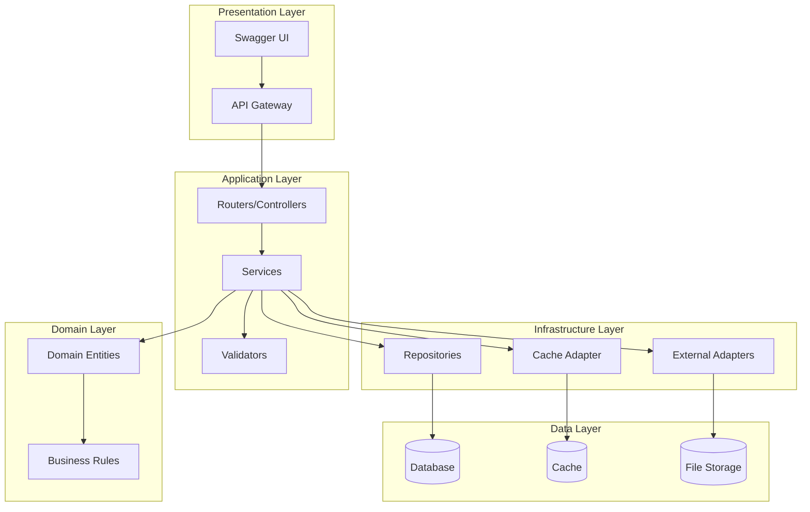
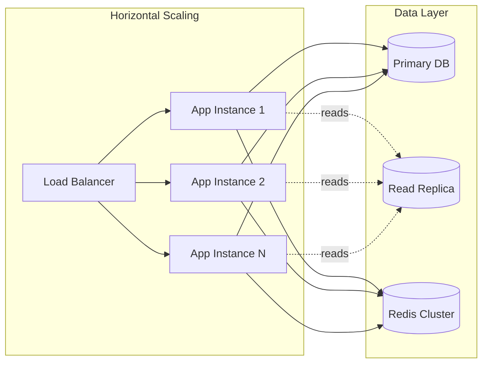
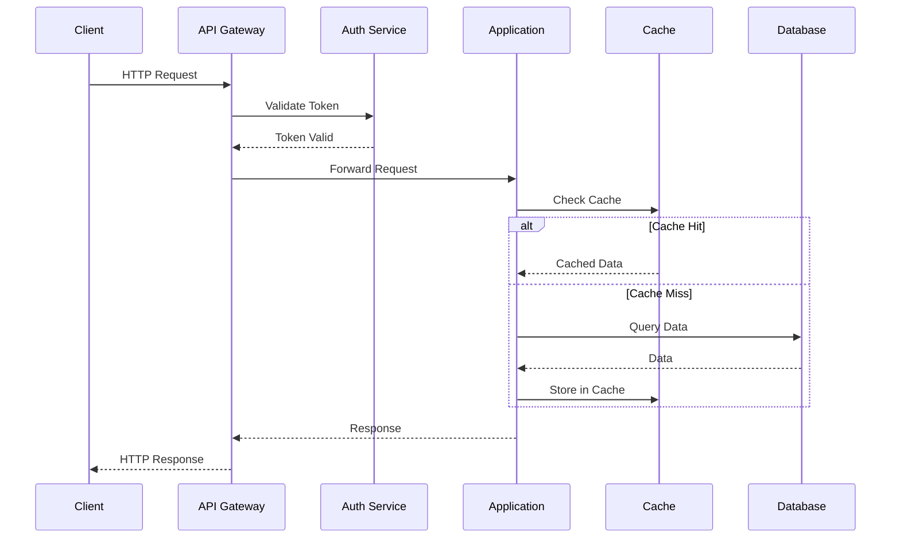
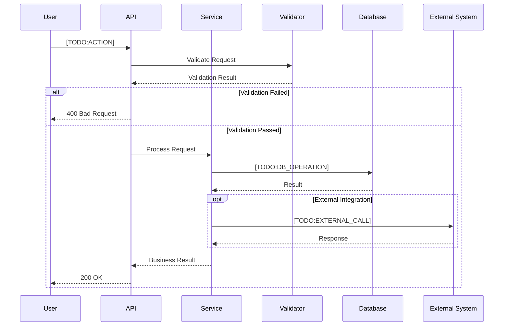
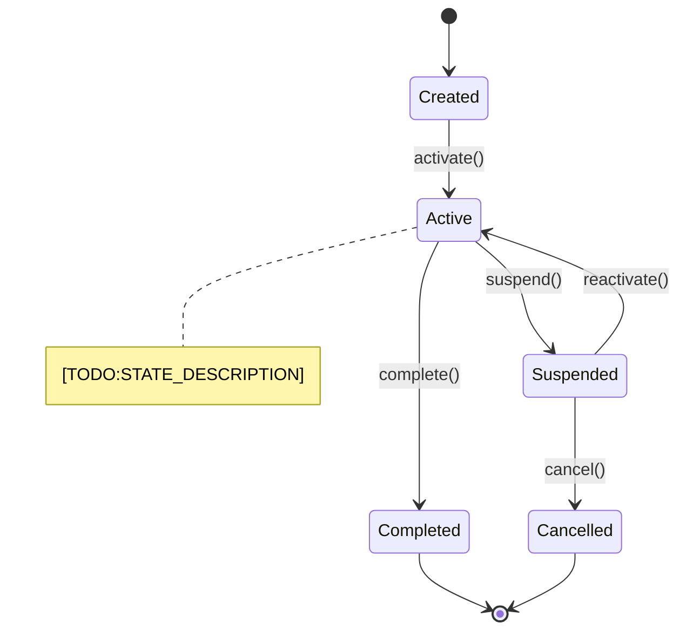
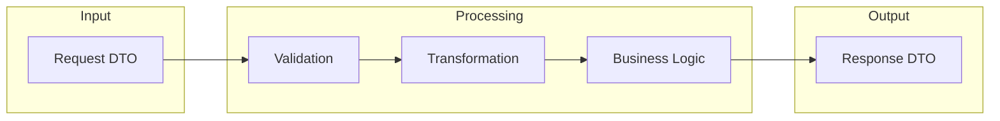
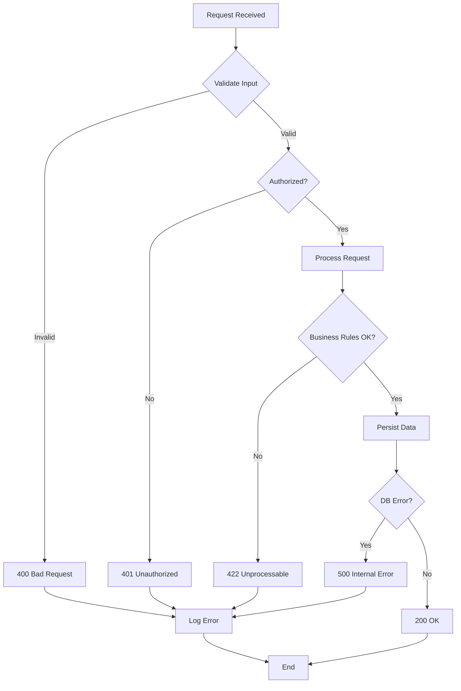
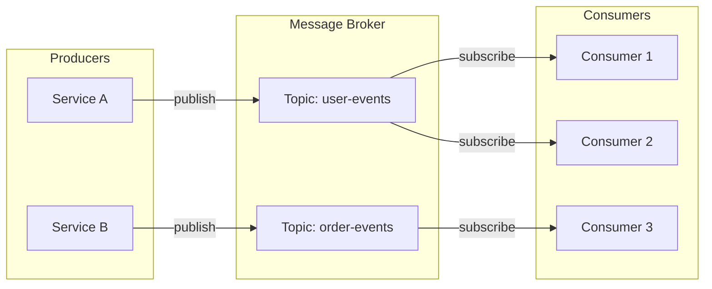
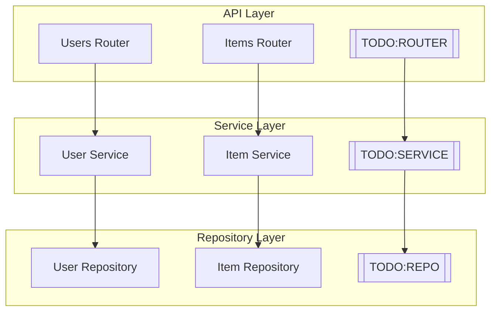

# Architecture Documentation Generator Prompt

## Purpose
Generate comprehensive architecture documentation including system overview, component diagrams, sequence diagrams, and data flow documentation using Mermaid diagrams.

## Instructions for AI Agent

Generate architecture documentation with the following structure. Use Mermaid for all diagrams except block architecture diagrams (which may use external tools like Miro).

---

## Architecture Documentation Template

### File: `docs/architecture/README.md`

```markdown
# Architecture Documentation

## Overview

This directory contains the architecture documentation for [PROJECT_NAME].

## Documents

| Document | Description |
|----------|-------------|
| [overview.md](overview.md) | High-level system architecture |
| [components.md](components.md) | Component descriptions and responsibilities |
| [data-flow.md](data-flow.md) | Data flow and sequence diagrams |
| [decisions.md](decisions.md) | Architecture Decision Records (ADRs) |
| [security.md](security.md) | Security architecture |
| [deployment.md](deployment.md) | Deployment architecture |

## External Resources

- **Miro Board**: [TODO:MIRO_LINK] (Block architecture diagrams)
- **Confluence**: [TODO:CONFLUENCE_LINK]
- **Design Documents**: [TODO:DESIGN_DOCS_LINK]
```

---

### File: `docs/architecture/overview.md`

```markdown
# System Architecture Overview

## Executive Summary

[TODO:EXECUTIVE_SUMMARY]
<!--
Provide a 2-3 paragraph summary of:
- What the system does
- Key architectural decisions
- Main technologies used
-->

## System Context

### Context Diagram

```mermaid
graph TB
    subgraph "External Actors"
        USER[👤 End Users]
        ADMIN[👤 Administrators]
        EXT_SYS[🔗 External Systems]
    end
    
    subgraph "System Boundary"
        APP[📦 [PROJECT_NAME]]
    end
    
    subgraph "External Dependencies"
        AUTH[🔐 Identity Provider]
        DB[(🗄️ Database)]
        CACHE[(⚡ Cache)]
        QUEUE[📬 Message Queue]
    end
    
    USER -->|"HTTP/REST"| APP
    ADMIN -->|"HTTP/REST"| APP
    EXT_SYS -->|"API"| APP
    
    APP -->|"OAuth/OIDC"| AUTH
    APP -->|"SQL"| DB
    APP -->|"Redis Protocol"| CACHE
    APP -->|"AMQP"| QUEUE
```

### System Boundaries

| Boundary | Description |
|----------|-------------|
| **In Scope** | [TODO:IN_SCOPE] |
| **Out of Scope** | [TODO:OUT_OF_SCOPE] |
| **Interfaces** | [TODO:INTERFACES] |

## High-Level Architecture

### Block Architecture Diagram

> **Note**: For detailed block architecture diagrams, see the Miro board: [TODO:MIRO_LINK]


<!-- TODO: Add block architecture image or link to Miro -->

### Component Overview



## Technology Stack

| Layer | Technology | Version | Rationale |
|-------|------------|---------|-----------|
| **Language** | Python | 3.11+ | [TODO:RATIONALE] |
| **Framework** | FastAPI | 0.109+ | [TODO:RATIONALE] |
| **Database** | PostgreSQL | 15+ | [TODO:RATIONALE] |
| **Cache** | Redis | 7+ | [TODO:RATIONALE] |
| **Message Queue** | [TODO:MQ] | [VERSION] | [TODO:RATIONALE] |
| **Container** | Docker | 24+ | [TODO:RATIONALE] |
| **Orchestration** | [TODO:ORCH] | [VERSION] | [TODO:RATIONALE] |

## Key Design Decisions

| Decision | Choice | Rationale | Alternatives Considered |
|----------|--------|-----------|------------------------|
| API Style | REST | [TODO:RATIONALE] | GraphQL, gRPC |
| Database | PostgreSQL | [TODO:RATIONALE] | MySQL, MongoDB |
| [TODO:DECISION] | [CHOICE] | [RATIONALE] | [ALTERNATIVES] |

See [decisions.md](decisions.md) for detailed Architecture Decision Records.

## Non-Functional Requirements

### Performance

| Metric | Target | Current |
|--------|--------|---------|
| Response Time (p95) | < 200ms | [TODO:CURRENT] |
| Throughput | 1000 req/s | [TODO:CURRENT] |
| Availability | 99.9% | [TODO:CURRENT] |

### Scalability



### Security

See [security.md](security.md) for detailed security architecture.

## Integration Points

| System | Protocol | Direction | Purpose |
|--------|----------|-----------|---------|
| [TODO:SYSTEM_1] | REST/HTTP | Inbound | [PURPOSE] |
| [TODO:SYSTEM_2] | REST/HTTP | Outbound | [PURPOSE] |
| [TODO:SYSTEM_3] | Events | Bidirectional | [PURPOSE] |

---

*Last updated: [DATE]*
```

---

### File: `docs/architecture/data-flow.md`

```markdown
# Data Flow Documentation

## Overview

This document describes how data flows through the system for key operations.

## Request/Response Flow

### General API Request Flow



## Key Business Flows

### [TODO:FLOW_1_NAME] Flow

**Business Context**: [TODO:BUSINESS_CONTEXT]



### [TODO:FLOW_2_NAME] Flow

**Business Context**: [TODO:BUSINESS_CONTEXT]

```mermaid
sequenceDiagram
    participant [TODO:PARTICIPANTS]
    
    Note over [PARTICIPANTS]: [TODO:FLOW_DESCRIPTION]
    
    [TODO:SEQUENCE_STEPS]
```

## State Diagrams

### [TODO:ENTITY_NAME] State Machine



## Data Transformation

### Input to Output Mapping



## Error Handling Flow



## Event Flow (if applicable)



---

*Last updated: [DATE]*
```

---

### File: `docs/architecture/components.md`

```markdown
# Component Documentation

## Component Overview



## Component Details

### [Component Name]

| Attribute | Value |
|-----------|-------|
| **Location** | `src/[package]/[module].py` |
| **Responsibility** | [TODO:RESPONSIBILITY] |
| **Dependencies** | [TODO:DEPENDENCIES] |
| **Dependents** | [TODO:DEPENDENTS] |

**Description**: [TODO:DESCRIPTION]

**Key Methods**:
- `method_name()`: [PURPOSE]
- `method_name()`: [PURPOSE]

**Business Rules Enforced**:
- [TODO:RULE_1]
- [TODO:RULE_2]

---

*Last updated: [DATE]*
```

---

## Agent Interaction Mode

When generating architecture documentation, ask for:

### Required Information
1. "What is the high-level purpose of this system?"
2. "What are the main components and their responsibilities?"
3. "What external systems does this integrate with?"
4. "What are the key business flows that need to be documented?"
5. "Is there a Miro board link for block architecture diagrams?"

### Optional Information
6. "What are the non-functional requirements (performance, availability)?"
7. "What security considerations are important?"
8. "Are there any Architecture Decision Records (ADRs) to reference?"

Generate diagrams using Mermaid syntax. For block architecture diagrams that require more visual flexibility, include a placeholder for Miro board links.

## Mermaid Diagram Types to Use

| Diagram Type | Use Case | Mermaid Syntax |
|--------------|----------|----------------|
| Flowchart | System context, component relationships | `graph TB/LR` |
| Sequence | API flows, interactions | `sequenceDiagram` |
| State | Entity lifecycles | `stateDiagram-v2` |
| Class | Domain models | `classDiagram` |
| ER | Database schema | `erDiagram` |
| Gantt | Timelines | `gantt` |

## Placeholder Reference

| Placeholder | Description |
|-------------|-------------|
| `[TODO:MIRO_LINK]` | Link to Miro board |
| `[TODO:CONFLUENCE_LINK]` | Link to Confluence page |
| `[TODO:BUSINESS_CONTEXT]` | Business context for a flow |
| `[TODO:RATIONALE]` | Rationale for a decision |
