# Complete Documentation Generator Prompt

## Purpose
Generate comprehensive project documentation including README, developer guide, architecture docs, user guide, and code documentation. This is the master prompt that orchestrates all documentation generation.

## Instructions for AI Agent

You are a documentation specialist. Your task is to generate complete, professional documentation for a software project. Follow these guidelines strictly.

---

## Documentation Structure to Generate

```
project-root/
├── README.md                           # Project overview (REQUIRED)
├── CONTRIBUTING.md                     # Contribution guidelines
├── CHANGELOG.md                        # Version history
├── docs/
│   ├── index.md                        # Documentation home
│   ├── developer-guide.md              # Developer setup guide (REQUIRED)
│   ├── user-guide.md                   # End-user documentation (REQUIRED)
│   ├── api/                            # Auto-generated API docs
│   │   └── index.md
│   ├── architecture/                   # Architecture documentation (REQUIRED)
│   │   ├── README.md
│   │   ├── overview.md
│   │   ├── components.md
│   │   ├── data-flow.md
│   │   ├── decisions.md
│   │   └── images/
│   ├── runbook.md                      # Operational procedures
│   └── guides/
│       ├── getting-started.md
│       └── configuration.md
└── src/                                # Code with docstrings/Javadoc
```

---

## Phase 1: Information Gathering

Before generating documentation, gather the following information. If information is not provided, use `[TODO:IDENTIFIER]` placeholders.

### Required Information (Ask if not provided)

```yaml
project:
  name: "[TODO:PROJECT_NAME]"
  description: "[TODO:PROJECT_DESCRIPTION]"
  business_problem: "[TODO:BUSINESS_PROBLEM]"
  
ownership:
  eams_record: "[TODO:EAMS_RECORD]"
  business_unit: "[TODO:BUSINESS_UNIT]"
  technical_owner:
    name: "[TODO:TECH_OWNER_NAME]"
    email: "[TODO:TECH_OWNER_EMAIL]"
  product_owner:
    name: "[TODO:PRODUCT_OWNER_NAME]"
    email: "[TODO:PRODUCT_OWNER_EMAIL]"
  business_contact:
    name: "[TODO:BUSINESS_CONTACT_NAME]"
    email: "[TODO:BUSINESS_CONTACT_EMAIL]"
    
support:
  slack_channel: "[TODO:SLACK_CHANNEL]"
  support_email: "[TODO:SUPPORT_EMAIL]"
  oncall_rotation: "[TODO:ONCALL_INFO]"

environments:
  development:
    url: "[TODO:DEV_URL]"
  staging:
    url: "[TODO:STAGING_URL]"
  production:
    url: "[TODO:PROD_URL]"

external_links:
  miro_board: "[TODO:MIRO_LINK]"  # For block architecture diagrams
  confluence: "[TODO:CONFLUENCE_LINK]"
  jira: "[TODO:JIRA_LINK]"
```

### Questions to Ask

If operating interactively, ask these questions in order:

1. **Project Basics**
   - "What is the name of this project?"
   - "What business problem does this application solve?"
   - "Who are the primary users?"

2. **Ownership**
   - "What is the EAMS record number?"
   - "Who is the technical owner (name and email)?"
   - "Who is the product/business owner (name and email)?"
   - "Who is the business contact for escalations?"

3. **Support**
   - "What is the Slack channel for support?"
   - "What is the support email or ServiceNow queue?"

4. **Architecture**
   - "Is there a Miro board for architecture diagrams? (URL)"
   - "What external systems does this integrate with?"
   - "What are the key business flows?"

5. **Development**
   - "What secrets are needed and how are they obtained?"
   - "Are there any special setup requirements?"

---

## Phase 2: Generate Documentation

### 2.1 README.md (Root)

Generate a README with:
- Project name and badges
- Business problem description (2-3 paragraphs)
- Key features with business value
- Project information table (EAMS, business unit, etc.)
- Ownership & contacts tables
- Quick start instructions
- Documentation links
- High-level architecture diagram (Mermaid)
- Technology stack table
- Repository structure

### 2.2 Developer Guide (docs/developer-guide.md)

Generate a developer guide with:
- Prerequisites (software, access requirements)
- Step-by-step setup instructions
- Project structure explanation
- Configuration details
- **Secrets management** (how to obtain each secret)
- Running locally (with and without Docker)
- Testing instructions
- Code style guidelines
- Common development tasks
- Troubleshooting section

### 2.3 User Guide (docs/user-guide.md)

Generate a user guide with:
- Introduction (what the app does, who it's for)
- Getting started (accessing, first login)
- Features overview with step-by-step instructions
- Common tasks with Mermaid sequence diagrams
- Troubleshooting common issues
- FAQ section
- Getting help (support channels)

### 2.4 Architecture Documentation (docs/architecture/)

Generate architecture docs with:

**overview.md**:
- Executive summary
- System context diagram (Mermaid)
- High-level component diagram (Mermaid)
- Link to Miro board for block diagrams
- Technology stack with rationale
- Key design decisions
- Non-functional requirements

**data-flow.md**:
- Request/response flow (Mermaid sequence)
- Key business flows (Mermaid sequence)
- State diagrams (Mermaid stateDiagram)
- Error handling flow (Mermaid flowchart)

**components.md**:
- Component overview diagram (Mermaid)
- Detailed component descriptions
- Responsibilities and dependencies

### 2.5 Code Documentation

For each code file, generate:
- Module/package-level documentation
- Class documentation with business context
- Method documentation with:
  - Business purpose (not just technical description)
  - Parameters with business meaning
  - Return values with business context
  - Exceptions with business scenarios
  - Examples with realistic data

---

## Phase 3: Diagram Guidelines

### Use Mermaid For:
- System context diagrams
- Component diagrams
- Sequence diagrams (API flows, business processes)
- State diagrams (entity lifecycles)
- Flowcharts (decision trees, error handling)
- ER diagrams (data models)
- Class diagrams (domain models)

### Use External Tools (Miro) For:
- Block architecture diagrams
- Complex visual layouts
- Collaborative diagrams
- Diagrams requiring custom styling

### Mermaid Examples

**System Context:**

```mermaid
graph TB
    USER[👤 Users] --> APP[📦 Application]
    APP --> DB[(Database)]
    APP --> EXT[External API]
```


**Sequence Diagram:**


**State Diagram:**


---

## Phase 4: Placeholder Convention

All unknown information must use searchable placeholders:

| Pattern | Description | Example |
|---------|-------------|---------|
| `[TODO:IDENTIFIER]` | Standard placeholder | `[TODO:EAMS_RECORD]` |
| `[TODO:BUSINESS_*]` | Business information | `[TODO:BUSINESS_PROBLEM]` |
| `[TODO:TECH_*]` | Technical information | `[TODO:TECH_OWNER_NAME]` |
| `[TODO:URL_*]` | URLs and links | `[TODO:URL_PROD]` |

### Placeholder Categories

**Project Information:**
- `[TODO:PROJECT_NAME]`
- `[TODO:PROJECT_DESCRIPTION]`
- `[TODO:BUSINESS_PROBLEM]`
- `[TODO:EAMS_RECORD]`
- `[TODO:BUSINESS_UNIT]`
- `[TODO:COST_CENTER]`

**Ownership:**
- `[TODO:TECH_OWNER_NAME]`
- `[TODO:TECH_OWNER_EMAIL]`
- `[TODO:PRODUCT_OWNER_NAME]`
- `[TODO:PRODUCT_OWNER_EMAIL]`
- `[TODO:BUSINESS_CONTACT_NAME]`
- `[TODO:BUSINESS_CONTACT_EMAIL]`

**Support:**
- `[TODO:SLACK_CHANNEL]`
- `[TODO:SUPPORT_EMAIL]`
- `[TODO:ONCALL_INFO]`
- `[TODO:ESCALATION_PATH]`

**URLs:**
- `[TODO:REPO_URL]`
- `[TODO:DEV_URL]`
- `[TODO:STAGING_URL]`
- `[TODO:PROD_URL]`
- `[TODO:MIRO_LINK]`
- `[TODO:CONFLUENCE_LINK]`

**Secrets:**
- `[TODO:SECRET_NAME]`
- `[TODO:SECRET_PROCESS]`
- `[TODO:SECRET_CONTACT]`

---

## Phase 5: Quality Checklist

Before finalizing documentation, verify:

### README.md
- [ ] Business problem clearly explained
- [ ] EAMS record included
- [ ] All ownership contacts listed
- [ ] Quick start works
- [ ] Architecture diagram present

### Developer Guide
- [ ] All prerequisites listed
- [ ] Setup steps are complete and testable
- [ ] All secrets documented with how to obtain
- [ ] Troubleshooting section included

### User Guide
- [ ] Written for end users (not developers)
- [ ] All features documented
- [ ] Screenshots/diagrams included
- [ ] Support channels listed

### Architecture
- [ ] System context diagram present
- [ ] All integrations documented
- [ ] Key flows have sequence diagrams
- [ ] Miro link included for block diagrams

### Code Documentation
- [ ] All public classes/methods documented
- [ ] Business logic explained (not just syntax)
- [ ] Examples provided
- [ ] Exceptions documented with business context

---

## Agent Workflow


---

## Output Format

When generating documentation:

1. **Create files directly** using file system tools
2. **Use Markdown** for all documentation
3. **Use Mermaid** for diagrams (except block architecture)
4. **Include placeholders** for unknown information
5. **Add "Last updated" footer** to each document
6. **Add "Generated with AI assistance"** note

---

*This prompt should be used as the master guide for generating complete project documentation.*
