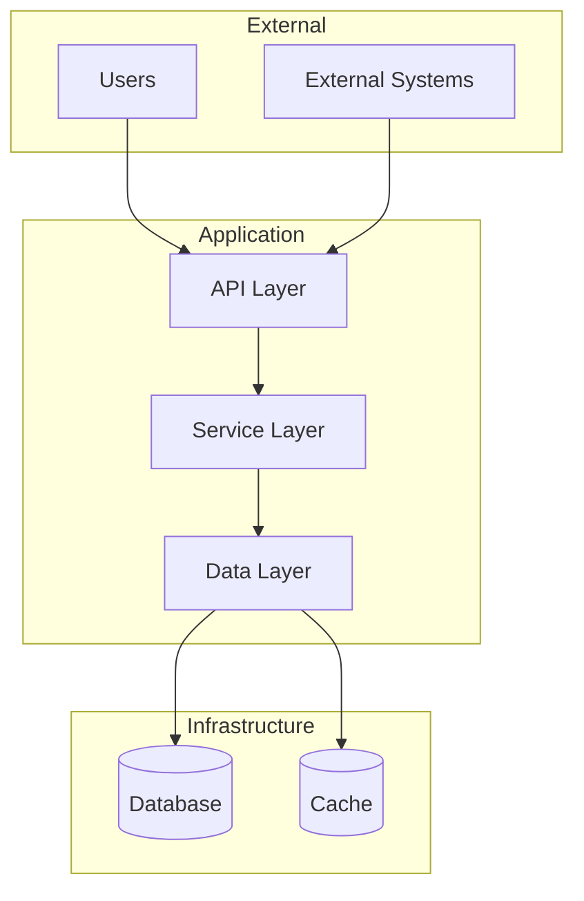

# README Generator Prompt

## Purpose
Generate a comprehensive README.md file for the repository root that serves as the primary entry point for understanding the project.

## Instructions for AI Agent

Generate a README.md with the following structure. Use placeholders for information you cannot determine.

---

## README Template

```markdown
# [Project Name]

[]()
[]()
[]()

## Business Problem

[TODO:BUSINESS_PROBLEM]
<!-- 
Describe in 2-3 paragraphs:
- What business problem does this application solve?
- Who are the end users and what value do they get?
- What was the situation before this solution existed?
-->

## Overview

[Brief technical overview of what this application does]

## Key Features

- **[Feature 1]**: [Business value it provides]
- **[Feature 2]**: [Business value it provides]
- **[Feature 3]**: [Business value it provides]

## Project Information

| Field | Value |
|-------|-------|
| **EAMS Record** | [TODO:EAMS_RECORD] |
| **Business Unit** | [TODO:BUSINESS_UNIT] |
| **Cost Center** | [TODO:COST_CENTER] |
| **Data Classification** | [TODO:DATA_CLASSIFICATION] |
| **Compliance Requirements** | [TODO:COMPLIANCE] |

## Ownership & Contacts

### Maintainers

| Role | Name | Email | Team |
|------|------|-------|------|
| **Technical Owner** | [TODO:TECH_OWNER_NAME] | [TODO:TECH_OWNER_EMAIL] | [TODO:TEAM] |
| **Product Owner** | [TODO:PRODUCT_OWNER_NAME] | [TODO:PRODUCT_OWNER_EMAIL] | [TODO:TEAM] |
| **Lead Developer** | [TODO:LEAD_DEV_NAME] | [TODO:LEAD_DEV_EMAIL] | [TODO:TEAM] |

### Business Contacts

| Role | Name | Email | Department |
|------|------|-------|------------|
| **Business Sponsor** | [TODO:SPONSOR_NAME] | [TODO:SPONSOR_EMAIL] | [TODO:DEPARTMENT] |
| **Subject Matter Expert** | [TODO:SME_NAME] | [TODO:SME_EMAIL] | [TODO:DEPARTMENT] |

### Support

- **Support Channel**: [TODO:SUPPORT_CHANNEL] (e.g., Slack channel, ServiceNow queue)
- **On-Call Rotation**: [TODO:ONCALL_INFO]
- **Escalation Path**: [TODO:ESCALATION_PATH]

## Quick Start

### Prerequisites

- [Prerequisite 1 with version]
- [Prerequisite 2 with version]

### Installation

```bash
# Clone the repository
git clone [REPO_URL]
cd [PROJECT_NAME]

# Install dependencies
[INSTALL_COMMAND]

# Run the application
[RUN_COMMAND]
```

### Verification

```bash
# Verify the installation
[VERIFICATION_COMMAND]

# Expected output
[EXPECTED_OUTPUT]
```

## Documentation

| Document | Description | Location |
|----------|-------------|----------|
| **Developer Guide** | Setup, development workflow, testing | [docs/developer-guide.md](docs/developer-guide.md) |
| **Architecture** | System design, diagrams, decisions | [docs/architecture/](docs/architecture/) |
| **API Reference** | Auto-generated API documentation | [docs/api/](docs/api/) |
| **User Guide** | End-user documentation | [docs/user-guide.md](docs/user-guide.md) |
| **Runbook** | Operational procedures | [docs/runbook.md](docs/runbook.md) |

## Architecture Overview

[Include a high-level architecture diagram or link]



For detailed architecture documentation, see [docs/architecture/](docs/architecture/).

## Technology Stack

| Layer | Technology | Version | Purpose |
|-------|------------|---------|---------|
| **Runtime** | [e.g., Python] | [version] | [purpose] |
| **Framework** | [e.g., FastAPI] | [version] | [purpose] |
| **Database** | [e.g., PostgreSQL] | [version] | [purpose] |
| **Cache** | [e.g., Redis] | [version] | [purpose] |
| **Message Queue** | [e.g., RabbitMQ] | [version] | [purpose] |

## Repository Structure

```
[PROJECT_NAME]/
├── src/                    # Application source code
├── tests/                  # Test suite
├── docs/                   # Documentation
│   ├── architecture/       # Architecture documentation
│   ├── api/               # API documentation
│   └── guides/            # User and developer guides
├── scripts/               # Utility scripts
├── config/                # Configuration files
└── README.md              # This file
```

## Development

See the [Developer Guide](docs/developer-guide.md) for detailed setup instructions.

### Quick Development Setup

```bash
# Setup development environment
[DEV_SETUP_COMMANDS]

# Run tests
[TEST_COMMAND]

# Run linting
[LINT_COMMAND]
```

## Deployment

| Environment | URL | Branch | Status |
|-------------|-----|--------|--------|
| **Development** | [TODO:DEV_URL] | `develop` | [TODO:STATUS] |
| **Staging** | [TODO:STAGING_URL] | `staging` | [TODO:STATUS] |
| **Production** | [TODO:PROD_URL] | `main` | [TODO:STATUS] |

## Contributing

1. Create a feature branch from `develop`
2. Make your changes with appropriate tests
3. Submit a pull request
4. Ensure CI passes and get code review approval

See [CONTRIBUTING.md](CONTRIBUTING.md) for detailed guidelines.

## License

[TODO:LICENSE_INFO]

## Changelog

See [CHANGELOG.md](CHANGELOG.md) for version history.

---

*Last updated: [DATE]*
*Generated with AI assistance - verify all [TODO:*] placeholders*
```

---

## Agent Interaction Mode

When generating the README, ask for the following information:

### Required Information
1. "What is the name of this project?"
2. "What business problem does this application solve?"
3. "Who are the primary users of this application?"
4. "What is the EAMS record number for this project?"
5. "Who is the technical owner and their contact information?"
6. "Who is the product/business owner and their contact information?"
7. "What is the support channel for this application?"

### Optional Information
8. "Are there any compliance requirements (SOX, PCI, HIPAA, etc.)?"
9. "What is the data classification level?"
10. "Is there a Miro board or Confluence page for architecture diagrams?"

Update the README iteratively based on responses, replacing placeholders with actual values.

## Placeholder Reference

All placeholders follow the pattern `[TODO:IDENTIFIER]` for easy searching:

| Placeholder | Description |
|-------------|-------------|
| `[TODO:BUSINESS_PROBLEM]` | Business problem description |
| `[TODO:EAMS_RECORD]` | EAMS record number |
| `[TODO:TECH_OWNER_NAME]` | Technical owner's name |
| `[TODO:TECH_OWNER_EMAIL]` | Technical owner's email |
| `[TODO:PRODUCT_OWNER_NAME]` | Product owner's name |
| `[TODO:PRODUCT_OWNER_EMAIL]` | Product owner's email |
| `[TODO:SUPPORT_CHANNEL]` | Support channel (Slack, ServiceNow) |
| `[TODO:DEV_URL]` | Development environment URL |
| `[TODO:STAGING_URL]` | Staging environment URL |
| `[TODO:PROD_URL]` | Production environment URL |
