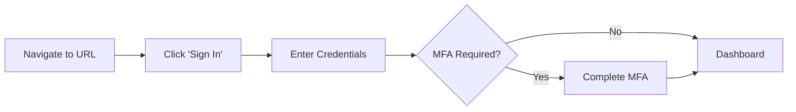
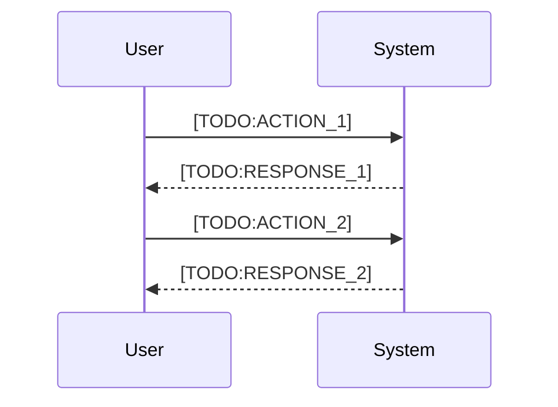

# User Guide Generator Prompt

## Purpose
Generate end-user documentation that explains how to use the application from a user's perspective.

## Instructions for AI Agent

Generate a user guide with the following structure. Use placeholders for information you cannot determine.

---

## User Guide Template

```markdown
# User Guide

## Table of Contents
1. [Introduction](#introduction)
2. [Getting Started](#getting-started)
3. [Features](#features)
4. [Common Tasks](#common-tasks)
5. [Troubleshooting](#troubleshooting)
6. [FAQ](#faq)
7. [Getting Help](#getting-help)

---

## Introduction

### What is [PROJECT_NAME]?

[TODO:PRODUCT_DESCRIPTION]
<!--
Describe in user-friendly terms:
- What the application does
- Who it's for
- What problems it solves
-->

### Who Should Use This Guide?

This guide is intended for:
- [TODO:USER_TYPE_1]: [DESCRIPTION]
- [TODO:USER_TYPE_2]: [DESCRIPTION]
- [TODO:USER_TYPE_3]: [DESCRIPTION]

### Prerequisites

Before using [PROJECT_NAME], you need:
- [ ] [TODO:PREREQ_1] (e.g., Valid company credentials)
- [ ] [TODO:PREREQ_2] (e.g., Appropriate role/permissions)
- [ ] [TODO:PREREQ_3] (e.g., VPN access if required)

---

## Getting Started

### Accessing the Application

**Production URL**: [TODO:PROD_URL]

**Supported Browsers**:
- Chrome (recommended) - version 90+
- Firefox - version 88+
- Safari - version 14+
- Edge - version 90+

### First-Time Login



1. Navigate to [TODO:PROD_URL]
2. Click **Sign In**
3. Enter your [TODO:CREDENTIAL_TYPE] credentials
4. Complete multi-factor authentication if prompted
5. You will be redirected to the dashboard

### Understanding the Interface


<!-- TODO: Add screenshot or describe the main interface -->

| Area | Description |
|------|-------------|
| **Navigation Bar** | [TODO:DESCRIPTION] |
| **Main Content** | [TODO:DESCRIPTION] |
| **Sidebar** | [TODO:DESCRIPTION] |
| **Footer** | [TODO:DESCRIPTION] |

---

## Features

### Feature 1: [TODO:FEATURE_NAME]

**Purpose**: [TODO:PURPOSE]

**How to Use**:

```mermaid
flowchart TD
    A[Start] --> B[Step 1: [TODO:STEP]]
    B --> C[Step 2: [TODO:STEP]]
    C --> D[Step 3: [TODO:STEP]]
    D --> E[Complete]
```

1. [TODO:STEP_1]
2. [TODO:STEP_2]
3. [TODO:STEP_3]

**Tips**:
- [TODO:TIP_1]
- [TODO:TIP_2]

### Feature 2: [TODO:FEATURE_NAME]

**Purpose**: [TODO:PURPOSE]

**How to Use**:
1. [TODO:STEP_1]
2. [TODO:STEP_2]
3. [TODO:STEP_3]

---

## Common Tasks

### Task: [TODO:TASK_NAME]

**When to Use**: [TODO:WHEN_TO_USE]

**Steps**:



1. [TODO:STEP_1]
2. [TODO:STEP_2]
3. [TODO:STEP_3]

**Expected Result**: [TODO:EXPECTED_RESULT]

### Task: [TODO:TASK_NAME]

[Repeat structure for each common task]

---

## Troubleshooting

### Common Issues

#### Issue: [TODO:ISSUE_DESCRIPTION]

**Symptoms**: 
- [TODO:SYMPTOM_1]
- [TODO:SYMPTOM_2]

**Cause**: [TODO:CAUSE]

**Solution**:
1. [TODO:SOLUTION_STEP_1]
2. [TODO:SOLUTION_STEP_2]

#### Issue: Cannot Log In

**Symptoms**:
- "Invalid credentials" error
- Page doesn't load after login

**Solutions**:
1. Verify you're using the correct URL: [TODO:PROD_URL]
2. Clear browser cache and cookies
3. Try a different browser
4. Contact IT support if issue persists

#### Issue: Page Not Loading

**Symptoms**:
- Blank page
- Spinning loader that never completes

**Solutions**:
1. Check your internet connection
2. Verify VPN is connected (if required)
3. Clear browser cache
4. Try refreshing the page (Ctrl+F5 / Cmd+Shift+R)

### Error Messages

| Error Code | Message | Meaning | Action |
|------------|---------|---------|--------|
| 400 | Bad Request | Invalid input | Check your input and try again |
| 401 | Unauthorized | Session expired | Log in again |
| 403 | Forbidden | No permission | Contact administrator |
| 404 | Not Found | Resource doesn't exist | Verify the URL/ID |
| 500 | Server Error | System issue | Try again later or contact support |

---

## FAQ

### General Questions

**Q: [TODO:QUESTION_1]?**

A: [TODO:ANSWER_1]

**Q: [TODO:QUESTION_2]?**

A: [TODO:ANSWER_2]

**Q: How do I reset my password?**

A: [TODO:PASSWORD_RESET_PROCESS]

**Q: Who can I contact for help?**

A: See the [Getting Help](#getting-help) section below.

### Feature-Specific Questions

**Q: [TODO:FEATURE_QUESTION]?**

A: [TODO:FEATURE_ANSWER]

---

## Getting Help

### Support Channels

| Channel | Use For | Response Time |
|---------|---------|---------------|
| **Self-Service** | FAQ, documentation | Immediate |
| **[TODO:SLACK_CHANNEL]** | Quick questions | < 4 hours |
| **[TODO:SUPPORT_EMAIL]** | Detailed issues | < 24 hours |
| **[TODO:TICKET_SYSTEM]** | Bug reports, feature requests | < 48 hours |

### Reporting Issues

When reporting an issue, please include:
1. **What you were trying to do**
2. **What happened instead**
3. **Steps to reproduce**
4. **Screenshots** (if applicable)
5. **Browser and version**
6. **Time the issue occurred**

### Feedback

We welcome your feedback! Please submit suggestions via:
- [TODO:FEEDBACK_CHANNEL]

---

## Appendix

### Keyboard Shortcuts

| Shortcut | Action |
|----------|--------|
| `Ctrl/Cmd + S` | Save |
| `Ctrl/Cmd + Z` | Undo |
| `Esc` | Close modal |
| [TODO:SHORTCUT] | [ACTION] |

### Glossary

| Term | Definition |
|------|------------|
| [TODO:TERM_1] | [DEFINITION] |
| [TODO:TERM_2] | [DEFINITION] |

---

*Last updated: [DATE]*
*Version: [VERSION]*
```

---

## Agent Interaction Mode

When generating the user guide, ask for:

### Required Information
1. "What is the application's main purpose from a user's perspective?"
2. "Who are the primary user types/roles?"
3. "What are the main features users interact with?"
4. "What are the most common tasks users perform?"
5. "What is the production URL?"
6. "What is the support channel for users?"

### Optional Information
7. "Are there any known issues or limitations?"
8. "What are the most frequently asked questions?"
9. "Are there any keyboard shortcuts?"
10. "Is there a glossary of terms users should know?"

Update the guide iteratively based on responses.
