# World Crop Monitor 1.0

**Global Food Security Early Warning System**

World Crop Monitor 1.0 addresses the global food security crisis by providing early visibility into crop stress conditions and climate impacts on agriculture worldwide. This integrated platform combines climate data visualization with crop stress monitoring, consolidating fragmented climate and satellite data into actionable early warnings for agricultural stakeholders and policymakers.


## Project Overview

### Business Problem

Global agriculture faces unprecedented challenges from climate variability and extreme weather events. Food security organizations, NGOs, and policymakers lack integrated tools to:

1. **Visualize Climate Impacts**: Understand historical climate trends and future projections across agricultural regions
2. **Monitor Crop Stress**: Track early indicators of agricultural stress (drought, heat, vegetation decline)
3. **Enable Early Action**: Provide actionable insights for disaster preparedness and food security planning
4. **Consolidate Data**: Integrate fragmented climate and satellite data from multiple open sources

World Crop Monitor 1.0 solves these challenges through an integrated platform combining climate analysis with crop stress monitoring, providing early warning capabilities to prevent food crises.

## Key Features

### Climate Visualization Component
- **Interactive Global Map**: Visualize historical climate data and future projections (2020-2100)
- **Multiple Climate Variables**: Temperature, precipitation, and other climate variables
- **Multiple Scenarios**: Support for CMIP5/CMIP6 climate scenarios (SSP1-2.6, SSP2-4.5, SSP3-7.0, SSP5-8.5)
- **Time Series Analysis**: Track climate trends and variations over decades
- **High-Resolution Tile Server**: Fast data rendering using vector tiles

### Crop Stress Monitoring Component
- **Interactive Global Map**: Visualize crop stress levels across 12 key agricultural regions worldwide
- **Multiple Stress Indicators**: Monitor drought, heat anomalies, vegetation stress, and rainfall anomalies
- **Risk Classification**: Severity levels (Critical, High, Medium, Low) based on composite stress index
- **Trend Analysis**: Track stress escalation or recovery over weekly and monthly periods
- **Data Transparency**: Clear display of data sources, update frequency, and confidence levels
- **Export Functionality**: Download data in JSON or CSV format
- **Actionable Recommendations**: Region-specific guidance based on current risk levels

## Data Sources

The application integrates data from multiple open sources:

### Climate Data
- **WorldClim**: Historical (1970-2000) and future climate projections from CMIP5/CMIP6 models
- **CRU TS**: Climatic Research Unit Time-Series data for historical climate
- **ERA5**: High-resolution reanalysis data from Copernicus Climate Data Store

### Crop & Agriculture Data
- **Open-Meteo API**: Historical and forecast weather data (temperature, precipitation)
- **FAO Open Data**: Crop baselines, food security zones, agricultural practices
- **Copernicus Sentinel-2**: Satellite-derived vegetation indices (NDVI)
- **Additional Sources**: NOAA, GDACS, JRC ERCC Portal

## Tech Stack

| Layer | Technology | Version |
|-------|-----------|---------|
| **Frontend (Client)** | Angular | Latest |
| **Frontend (Legacy)** | HTML5, CSS3, JavaScript (ES6+) | - |
| **Mapping Library** | Leaflet.js, TileServer GL | Latest |
| **Backend (Climate/Crop)** | Python, FastAPI | 3.9+ |
| **Backend (Express)** | Node.js, Express | 18+ |
| **Tile Rendering** | GDAL, Tippecanoe | 3.11.0, 1.19.1 |
| **Data Format** | GeoJSON, MBTiles, NetCDF | - |
| **Containerization** | Docker, Docker Compose | Latest |
| **Package Managers** | npm, pip | Latest |

## Project Structure

```
World Crop Monitor 1.0/
├── README.md                           # This file
├── package.json                         # Root package configuration
├── backend/                             # Legacy Node.js server
│   └── server.js
├── frontend/                            # Legacy frontend
│   ├── index.html
│   ├── css/
│   └── js/
├── climatemaps/                         # Main project (Climate + Crop Stress)
│   ├── docker-compose.yml
│   ├── pyproject.toml
│   ├── requirements.txt
│   ├── tileserver_config.json
│   ├── api/                             # FastAPI backend
│   │   ├── main.py
│   │   ├── middleware.py
│   │   ├── cache.py
│   │   ├── Dockerfile
│   │   └── __init__.py
│   ├── client/                          # Angular frontend
│   │   ├── angular.json
│   │   ├── package.json
│   │   ├── src/
│   │   ├── public/
│   │   └── tsconfig.json
│   ├── climatemaps/                     # Core Python modules
│   │   ├── config.py
│   │   ├── data.py
│   │   ├── contour.py
│   │   ├── tile.py
│   │   ├── ensemble.py
│   │   └── settings/
│   ├── data/                            # Data storage
│   │   ├── raw/
│   │   └── tiles/
│   ├── scripts/                         # Utility scripts
│   │   ├── create_contour.py
│   │   ├── create_ensemble_mean.py
│   │   └── download_tiles.sh
│   └── infra/                           # Infrastructure config
│       └── openclimatemap.nginx.conf
├── docs/                                # Documentation
│   ├── developer-guide.md
│   ├── user-guide.md
│   ├── architecture/
│   │   ├── overview.md
│   │   ├── components.md
│   │   └── data-flow.md
│   └── index.md
└── vercel.json                          # Deployment configuration
```

## High-Level Architecture

```mermaid
graph TB
    subgraph Users["👥 Users"]
        NGO["NGO Staff"]
        Policy["Policymakers"]
        Research["Researchers"]
    end
    
    subgraph Frontend["🖥️ Frontend Layer"]
        Angular["Angular Web App"]
        Legacy["Legacy Frontend"]
        Map["Interactive Map"]
    end
    
    subgraph API["⚙️ API Layer"]
        FastAPI["FastAPI Backend"]
        Express["Express Server"]
        Cache["Redis Cache"]
    end
    
    subgraph Processing["🔄 Data Processing"]
        Contour["Contour Generation"]
        Tiles["Tile Rendering"]
        Ensemble["Ensemble Calculation"]
    end
    
    subgraph DataSources["📊 External Data"]
        WorldClim["WorldClim Climate Data"]
        OpenMeteo["Open-Meteo Weather"]
        FAO["FAO Agriculture Data"]
        Sentinel["Sentinel-2 Satellite"]
    end
    
    subgraph Storage["💾 Storage"]
        MBTiles["MBTiles Vector Tiles"]
        Database["PostgreSQL/GeoJSON"]
        Cache2["Tile Cache"]
    end
    
    Users --> Frontend
    Frontend --> API
    API --> Processing
    Processing --> Storage
    DataSources --> Processing
    API --> DataSources
    Storage --> Frontend
```



## Project Information

| Property | Value |
|----------|-------|
| **Project Name** | World Crop Monitor 1.0 |
| **EAMS Record** | [TODO:EAMS_RECORD] |
| **Business Unit** | [TODO:BUSINESS_UNIT] |
| **Cost Center** | [TODO:COST_CENTER] |
| **Repository URL** | [TODO:REPO_URL] |
| **Live Environment** | https://openclimatemap.org (Climate Maps) |

## Ownership & Contacts

### Technical Ownership

| Role | Name | Email | Slack |
|------|------|-------|-------|
| Technical Owner | [TODO:TECH_OWNER_NAME] | [TODO:TECH_OWNER_EMAIL] | [TODO:SLACK_CHANNEL] |
| Technical Lead (Climate Maps) | [TODO:CLIMATE_TECH_LEAD] | [TODO:CLIMATE_TECH_EMAIL] | [TODO:SLACK_CHANNEL] |
| Technical Lead (Crop Stress) | [TODO:CROP_TECH_LEAD] | [TODO:CROP_TECH_EMAIL] | [TODO:SLACK_CHANNEL] |

### Business Ownership

| Role | Name | Email |
|------|------|-------|
| Product Owner | [TODO:PRODUCT_OWNER_NAME] | [TODO:PRODUCT_OWNER_EMAIL] |
| Business Contact | [TODO:BUSINESS_CONTACT_NAME] | [TODO:BUSINESS_CONTACT_EMAIL] |

### Support

| Channel | Value |
|---------|-------|
| **Slack Channel** | [TODO:SLACK_CHANNEL] |
| **Support Email** | [TODO:SUPPORT_EMAIL] |
| **On-Call Rotation** | [TODO:ONCALL_INFO] |
| **Escalation Path** | [TODO:ESCALATION_PATH] |

## Environments

| Environment | URL | Status |
|-------------|-----|--------|
| **Development** | [TODO:DEV_URL] | Active |
| **Staging** | [TODO:STAGING_URL] | Active |
| **Production** | https://openclimatemap.org | Active |

## Installation

### Option 1: Run with Docker Compose (Recommended)

```bash
# Clone the repository
git clone [TODO:REPO_URL]
cd World Crop Monitor 1.0

# Navigate to climatemaps
cd climatemaps

# Copy environment file
cp .env.example .env

# Start all services
docker-compose up -d

# Access applications
# Climate Maps: http://localhost:3000
# API: http://localhost:8000
# TileServer: http://localhost:8080
```

### Option 2: Run Individual Components

#### Climate Maps Client (Angular)
```bash
cd climatemaps/client
npm install
npm start
# Access at http://localhost:4200
```

#### Backend API (FastAPI)
```bash
cd climatemaps/api
pip install -r requirements.txt
uvicorn main:app --reload
# API at http://localhost:8000
```

#### TileServer GL
```bash
cd climatemaps
tileserver-gl --config tileserver_config_dev.json --port 8080
# Access at http://localhost:8080
```

#### Frontend (Legacy)
```bash
cd frontend
# Open index.html in a web browser
# Requires simple HTTP server
python -m http.server 8000
```

### Option 3: Legacy Setup (Express Backend)

1. **Clone the repository**
   ```bash
   git clone [TODO:REPO_URL]
   cd World Crop Monitor 1.0
   ```

2. **Install dependencies**
   ```bash
   npm install
   ```

3. **Start the development server**
   ```bash
   npm start
   ```

4. **Open in browser**
   Navigate to `http://localhost:3000`

## API Endpoints

| Endpoint | Method | Description |
|----------|--------|-------------|
| `/api/crop-stress` | GET | Returns current crop stress data for all regions |
| `/api/historical/:region` | GET | Returns historical data for a specific region |
| `/api/regions` | GET | Returns list of monitored regions |
| `/api/export/:format` | GET | Exports data in JSON or CSV format |

## Methodology

### Crop Stress Index Calculation

The composite Crop Stress Index (0-100) is calculated using weighted factors:

| Indicator | Weight | Data Source |
|-----------|--------|-------------|
| Drought Index | 40% | Rainfall deficit, soil moisture |
| Heat Anomaly | 30% | Temperature above optimal thresholds |
| Vegetation Stress | 30% | NDVI anomalies from satellite data |

### Risk Levels

| Level | Index Range | Description |
|-------|-------------|-------------|
| **Critical** | 75-100 | Immediate intervention needed |
| **High** | 50-74 | Significant risk, close monitoring required |
| **Medium** | 25-49 | Moderate concern, preventive measures recommended |
| **Low** | 0-24 | Stable conditions, routine monitoring |

### Climate Projections

- **Time Horizon**: 2020-2100
- **Models**: CMIP5 and CMIP6 general circulation models
- **Scenarios**: SSP1-2.6, SSP2-4.5, SSP3-7.0, SSP5-8.5 (from IPCC AR6)
- **Resolution**: 5-minute resolution (~10 km at equator)

## Documentation

For detailed information, see:

- **[Developer Guide](docs/developer-guide.md)** - Setup, configuration, and development instructions
- **[User Guide](docs/user-guide.md)** - End-user features and usage instructions
- **[Architecture Documentation](docs/architecture/overview.md)** - System design and components
- **[Component Details](docs/architecture/components.md)** - Detailed component descriptions
- **[Data Flow](docs/architecture/data-flow.md)** - Data processing pipelines and workflows
- **[Contributing Guide](CONTRIBUTING.md)** - How to contribute to the project
- **[Changelog](CHANGELOG.md)** - Version history and release notes

## API Endpoints (Legacy/Express Backend)

| Endpoint | Method | Description |
|----------|--------|-------------|
| `/api/crop-stress` | GET | Returns current crop stress data for all regions |
| `/api/historical/:region` | GET | Returns historical data for a specific region |
| `/api/regions` | GET | Returns list of monitored regions |
| `/api/export/:format` | GET | Exports data in JSON or CSV format (format: json or csv) |

## Methodology

### Crop Stress Index Calculation

The composite Crop Stress Index (0-100) is calculated using weighted factors:

| Indicator | Weight | Data Source |
|-----------|--------|-------------|
| Drought Index | 40% | Rainfall deficit, soil moisture |
| Heat Anomaly | 30% | Temperature above optimal thresholds |
| Vegetation Stress | 30% | NDVI anomalies from satellite data |

### Risk Levels

| Level | Index Range | Description |
|-------|-------------|-------------|
| Critical | 70-100 | Immediate intervention required |
| High | 50-69 | Monitor closely, prepare contingency plans |
| Medium | 30-49 | Regular monitoring, assess mitigation needs |
| Low | 0-29 | Standard monitoring protocols |

## License

MIT License - See LICENSE.md files in respective directories

## Support & Contact

For questions or support:
- **Technical Issues**: [TODO:SLACK_CHANNEL]
- **Feature Requests**: Contact [TODO:PRODUCT_OWNER_NAME]
- **Urgent Issues**: Contact [TODO:TECH_OWNER_NAME]
- **Email**: [TODO:SUPPORT_EMAIL]

## External References

- **Climate Maps Demo**: https://openclimatemap.org
- **Architecture Diagrams**: [TODO:MIRO_LINK]
- **Project Board**: [TODO:JIRA_LINK]
- **Confluence Docs**: [TODO:CONFLUENCE_LINK]

---

**Last Updated**: February 2, 2026

*Documentation generated with AI assistance following World Crop Monitor 1.0 documentation standards.*
