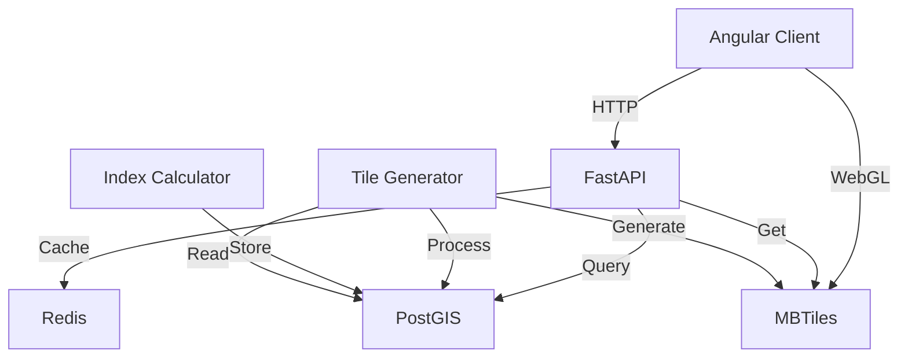

# Component Architecture

**Detailed Component Descriptions and Interactions**

This document provides in-depth technical documentation for each major component in the HackEarth system.

## Table of Contents

1. [Component Overview](#component-overview)
2. [Frontend Components](#frontend-components)
3. [API Layer Components](#api-layer-components)
4. [Data Processing Components](#data-processing-components)
5. [Storage Components](#storage-components)
6. [Component Dependencies](#component-dependencies)
7. [Communication Protocols](#communication-protocols)

---

## Component Overview

```mermaid
graph LR
    subgraph Client["Frontend"]
        Direction WEB["Web Browser<br/>(Client)"]
    end
    
    subgraph Gateway["Gateway Layer"]
        Direction LB["Load Balancer<br/>(nginx)"]
        Direction AC["API Gateway<br/>(routing, logging)"]
    end
    
    subgraph Backend["Backend Services"]
        Direction API["FastAPI<br/>(Python)"]
        Direction EXP["Express.js<br/>(Node.js)"]
    end
    
    subgraph Compute["Compute Layer"]
        Direction TILE["Tile Generator<br/>(GDAL, Tippecanoe)"]
        Direction CONT["Contour Engine<br/>(matplotlib)"]
        Direction CALC["Index Calculator<br/>(NumPy/SciPy)"]
    end
    
    subgraph Store["Storage Layer"]
        Direction DB["PostGIS<br/>(Spatial DB)"]
        Direction MBT["MBTiles<br/>(Tiles)"]
        Direction CACHE["Redis<br/>(Cache)"]
    end
    
    WEB <--> LB
    LB <--> AC
    AC <--> API
    AC <--> EXP
    API <--> TILE
    API <--> CONT
    API <--> CALC
    TILE <--> DB
    CONT <--> DB
    CALC <--> DB
    API <--> CACHE
    EXP <--> CACHE
```

---

## Frontend Components

### 1. Angular Web Client

**Location:** `climatemaps/client/`

**Responsibility:** User interface, interactive maps, data visualization

**Key Features:**
- Interactive mapping using Leaflet.js
- Data layer management
- Time series visualization
- Export functionality
- Search and navigation

**Architecture:**

```
src/
├── app/
│   ├── core/                    # Singleton services
│   │   ├── climate.service.ts       # Climate data fetching
│   │   ├── crop.service.ts          # Crop stress data
│   │   ├── geocoding.service.ts     # Location search
│   │   └── local-storage.service.ts # Persistence
│   ├── map/                     # Map components
│   │   ├── map.component.ts         # Main map
│   │   ├── layers.component.ts      # Layer control
│   │   ├── legend.component.ts      # Legend display
│   │   └── toolbar.component.ts     # Map controls
│   ├── data/                    # Data management
│   │   ├── data-selector.component.ts
│   │   ├── time-series.component.ts
│   │   └── export.component.ts
│   └── shared/                  # Shared utilities
│       ├── pipes/
│       ├── directives/
│       └── utils/
├── environments/                # Environment config
└── styles/                      # Global styles
```

**Key Services:**

1. **ClimateService**
   - Fetches climate data from FastAPI
   - Caches results locally
   - Handles multiple scenarios
   - Provides time series data

2. **CropService**
   - Retrieves crop stress index
   - Updates based on refresh rate
   - Provides historical data
   - Manages alerts

3. **GeocodingService**
   - Location search (geocoding)
   - Reverse geocoding
   - Region boundary lookup
   - Coordinates management

4. **LocalStorageService**
   - User preferences (zoom, center)
   - Selected layers
   - Recent searches
   - Favorites/bookmarks

**Technology Stack:**
- Angular 16+ with TypeScript
- RxJS for reactive programming
- Leaflet for mapping
- Bootstrap for layout

**Dependencies:**
- Node.js 18+
- npm packages (angular, leaflet, etc.)

---

### 2. Legacy Frontend

**Location:** `frontend/`

**Responsibility:** Fallback web interface for older browsers

**Status:** Maintained for backward compatibility

**Files:**
- `index.html`: Single-page structure
- `css/styles.css`: All styling
- `js/app.js`: Client-side logic

**Limitations:**
- Basic functionality only
- No advanced features
- Limited browser support
- Deprecated - use Angular client

---

## API Layer Components

### 1. FastAPI Backend (Climate & Crop)

**Location:** `climatemaps/api/`

**Responsibility:** REST API for climate and crop data

**Endpoints:**

```
GET  /health                        # Health check
GET  /api/v1/climate/data           # Climate data by coordinates
GET  /api/v1/climate/historical     # Historical climate
GET  /api/v1/climate/projections    # Future projections
GET  /api/v1/climate/scenarios      # Available scenarios
GET  /api/v1/climate/variables      # Available variables
GET  /api/v1/crop/stress            # Current crop stress
GET  /api/v1/crop/historical        # Crop stress history
GET  /api/v1/crop/regions           # Monitored regions
GET  /api/v1/export/data            # Export endpoint
GET  /api/v1/tiles/{z}/{x}/{y}      # Tile serving (WebGL)
```

**Key Components:**

```python
# api/main.py - Entry point
from fastapi import FastAPI
app = FastAPI()

# Routes organized by domain
# - climate routes
# - crop routes
# - tiles routes
# - export routes

# Middleware
# - CORS handling
# - Request logging
# - Error handling
```

**Middleware (`api/middleware.py`):**
- CORS (Cross-Origin Resource Sharing)
- Request logging and tracing
- Error handling and standardized responses
- Request validation

**Caching (`api/cache.py`):**
- Redis integration for performance
- Cache invalidation strategies
- TTL-based expiration
- Cache warming

**Key Features:**
- Async request handling (performance)
- Automatic API documentation (Swagger)
- Request validation with Pydantic
- Error handling and status codes

**Dependencies:**
- Python 3.9+
- FastAPI
- Pydantic
- Redis client
- PostgreSQL driver

---

### 2. Express.js Server

**Location:** `backend/server.js`

**Responsibility:** Legacy API for backward compatibility

**Endpoints:**

```
GET  /api/crop-stress           # Legacy crop endpoint
GET  /api/historical/:region    # Legacy historical
GET  /api/regions               # Region list
GET  /api/export/:format        # Legacy export
```

**Status:** Maintained for backward compatibility, new features use FastAPI

**Technology:** Node.js 18+, Express.js

---

## Data Processing Components

### 1. Tile Generator

**Location:** `climatemaps/scripts/create_contour.py`

**Responsibility:** Generate vector tiles from climate data

**Process:**
```
Input: GeoTIFF or NetCDF climate data
  ↓
Read and validate (GDAL/rasterio)
  ↓
Reproject to Web Mercator
  ↓
Resample to target resolution
  ↓
Generate contours (matplotlib contouring)
  ↓
Convert to GeoJSON
  ↓
Create MBTiles (tippecanoe)
  ↓
Output: MBTiles file
```

**Configuration:**
```python
# climatemaps/contour_config.py
CONTOUR_LEVELS = {
    'temperature': np.arange(-40, 50, 5),
    'precipitation': np.arange(0, 5000, 250),
    'humidity': np.arange(0, 100, 10)
}

COLORS = {
    'temperature': ['blue', 'cyan', 'green', 'yellow', 'red'],
    'precipitation': ['brown', 'yellow', 'lightgreen', 'green', 'darkblue']
}
```

**Performance:**
- Processing time: 30-60 minutes per variable
- Output size: 50-500 MB per variable
- Compression: MBTiles built-in compression

**Dependencies:**
- GDAL 3.11+
- Tippecanoe 1.19.1
- GeoPandas
- matplotlib

---

### 2. Contour Engine

**Location:** `climatemaps/contour.py`

**Responsibility:** Calculate and render contour lines

**Algorithm:**
1. Read gridded data from GeoTIFF/NetCDF
2. Define contour levels based on variable
3. Use matplotlib contouring algorithm
4. Generate polygon features
5. Add attributes and metadata
6. Store as GeoJSON

**Example:**
```python
import matplotlib.pyplot as plt
import numpy as np

# Create contours for temperature data
temperature_grid = read_geotiff('temperature.tif')
levels = np.arange(-40, 50, 5)
contours = plt.contour(temperature_grid, levels=levels)
# Convert to GeoJSON for storage
```

**Output:** GeoJSON features with properties:
- Temperature/precipitation value
- Contour level
- Geometry (LineString/Polygon)

---

### 3. Index Calculator

**Location:** `climatemaps/ensemble.py`

**Responsibility:** Calculate crop stress index from multiple indicators

**Algorithm:**
```
Input: Drought, Heat, Vegetation data
  ↓
Normalize each to 0-100 scale
  ↓
Apply weights:
  - Drought: 40%
  - Heat: 30%
  - Vegetation: 30%
  ↓
Calculate: Index = 0.4*D + 0.3*H + 0.3*V
  ↓
Output: Stress index (0-100)
```

**Calculation:**
```python
def calculate_stress_index(
    drought_index: float,
    heat_anomaly: float,
    vegetation_stress: float
) -> float:
    """Calculate composite crop stress index."""
    weights = {
        'drought': 0.4,
        'heat': 0.3,
        'vegetation': 0.3
    }
    
    stress = (
        drought_index * weights['drought'] +
        heat_anomaly * weights['heat'] +
        vegetation_stress * weights['vegetation']
    )
    return np.clip(stress, 0, 100)
```

**Update Frequency:** Hourly for real-time monitoring

---

### 4. Ensemble Processor

**Location:** `climatemaps/ensemble.py`

**Responsibility:** Process multiple climate models

**Features:**
- Combine predictions from multiple GCMs (General Circulation Models)
- Calculate mean, stddev, percentiles
- Uncertainty quantification
- Weighted ensemble (model performance-based)

**Example:**
```python
# Combine CMIP5 and CMIP6 models
models = ['model1', 'model2', 'model3', 'model4']
ensemble_mean = np.mean([read_model(m) for m in models], axis=0)
ensemble_std = np.std([read_model(m) for m in models], axis=0)
```

---

## Storage Components

### 1. PostgreSQL + PostGIS

**Purpose:** Spatial database for feature storage and querying

**Schema:**

```sql
-- Climate data table
CREATE TABLE climate_data (
    id SERIAL PRIMARY KEY,
    variable_name VARCHAR(50),
    date DATE,
    scenario VARCHAR(20),
    geometry GEOMETRY(POINT, 4326),
    value FLOAT,
    confidence_level VARCHAR(20)
);

-- Crop stress table
CREATE TABLE crop_stress (
    id SERIAL PRIMARY KEY,
    region_name VARCHAR(100),
    date_time TIMESTAMP,
    stress_index FLOAT,
    drought_component FLOAT,
    heat_component FLOAT,
    vegetation_component FLOAT,
    geometry GEOMETRY(POLYGON, 4326)
);

-- Spatial indexes
CREATE INDEX idx_climate_geometry ON climate_data USING GIST(geometry);
CREATE INDEX idx_climate_date ON climate_data(date);
CREATE INDEX idx_crop_stress_date ON crop_stress(date_time);
```

**Performance:**
- Handles 100M+ spatial features
- Sub-second query response
- Parallel spatial indexing

**Maintenance:**
- Nightly backups
- Monthly VACUUM/ANALYZE
- Quarterly index rebuilds

---

### 2. MBTiles (Vector Tiles)

**Purpose:** Efficient tile storage for web mapping

**Format:**
- SQLite database with vector tiles
- Pre-generated for all zoom levels (0-14)
- Layer-based organization
- Built-in compression

**Zoom Levels:**
- Z0-2: Global view (countries)
- Z3-6: Regional view (provinces)
- Z7-10: Local view (districts)
- Z11-14: High detail (communes)

**File Size:** 50-500 MB per variable

**Tools:**
- Tippecanoe: MBTiles creation
- TileServer GL: Serving tiles

---

### 3. Redis Cache

**Purpose:** High-speed caching layer

**Usage:**
```python
# Cache climate API responses
@app.get("/api/v1/climate/data")
@cache(expire=3600)  # 1 hour TTL
def get_climate_data(lat: float, lon: float):
    # Expensive query
    return result
```

**Cache Keys:**
- `climate:{variable}:{scenario}:{date}:{zoom}`
- `crop:stress:{region}:{date}`
- `tiles:{z}:{x}:{y}:{variable}`

**Memory:** 2-5 GB typical

---

### 4. File Storage

**Purpose:** Raw data and intermediate processing

**Locations:**
```
data/
├── raw/                 # Input data (not versioned)
│   ├── temperature_*.tif
│   ├── precipitation_*.tif
│   └── vegetation_*.tif
├── processed/           # Intermediate processing
│   ├── contours_*.geojson
│   └── indices_*.csv
└── tiles/               # Generated tiles
    ├── climate_*.mbtiles
    └── crop_*.mbtiles
```

**Backup Strategy:**
- Daily incremental backups
- Weekly full backups
- Monthly archive to S3

---

## Component Dependencies

### Dependency Graph



### Version Compatibility

| Component | Version | Compatibility |
|-----------|---------|----------------|
| Python | 3.9+ | Required |
| FastAPI | 0.95+ | Latest recommended |
| Angular | 16+ | 14+ supported |
| PostgreSQL | 12+ | 13+ recommended |
| GDAL | 3.11.0 | Exact version |
| Tippecanoe | 1.19.1 | Exact version |
| Node.js | 18+ | 16+ supported |

---

## Communication Protocols

### HTTP/REST

**Base URLs:**
- Development: `http://localhost:8000/api/v1`
- Staging: `https://api-staging.openclimatemap.org/api/v1`
- Production: `https://api.openclimatemap.org/api/v1`

**Format:** JSON request/response

**Example Request:**
```bash
curl -X GET "http://localhost:8000/api/v1/climate/data?lat=0&lon=0&variable=temperature"
```

**Example Response:**
```json
{
  "variable": "temperature",
  "date": "2024-01-15",
  "coordinates": [0, 0],
  "value": 25.5,
  "confidence": "high",
  "unit": "°C"
}
```

### WebGL (Tile Protocol)

**Tile URL Pattern:**
```
/api/v1/tiles/{z}/{x}/{y}.json?style=default
```

**Response:** Compact vector tile format (Protocol Buffers)

### Database Connections

**Connection Pool:**
- Min: 5 connections
- Max: 20 connections
- Timeout: 30 seconds

**Query Examples:**

```sql
-- Climate data query
SELECT ST_AsGeoJSON(geometry), value 
FROM climate_data 
WHERE ST_Contains(geometry, ST_GeomFromText('POINT(0 0)', 4326))
AND date = '2024-01-15'
AND variable_name = 'temperature';

-- Crop stress query
SELECT ST_AsGeoJSON(geometry), stress_index
FROM crop_stress
WHERE ST_DWithin(geometry, ST_GeomFromText('POINT(0 0)', 4326), 10000)
AND date_time > NOW() - INTERVAL '7 days'
ORDER BY date_time DESC;
```

---

## Monitoring & Observability

### Metrics

**Per Component:**
- Request count and latency (API)
- Processing time and success rate (Processors)
- Cache hit/miss ratio (Redis)
- Query execution time (Database)

**Collection:** Prometheus + Grafana

**Alerts:**
- API response time > 1000ms
- Error rate > 5%
- Cache memory > 80%
- Database disk space > 90%

---

## References

**Related Documentation:**
- [Architecture Overview](overview.md)
- [Data Flow Diagrams](data-flow.md)
- [Developer Guide](../developer-guide.md)

---

**Last Updated**: February 2, 2026

*For technical clarifications, contact [TODO:TECH_OWNER_NAME].*
