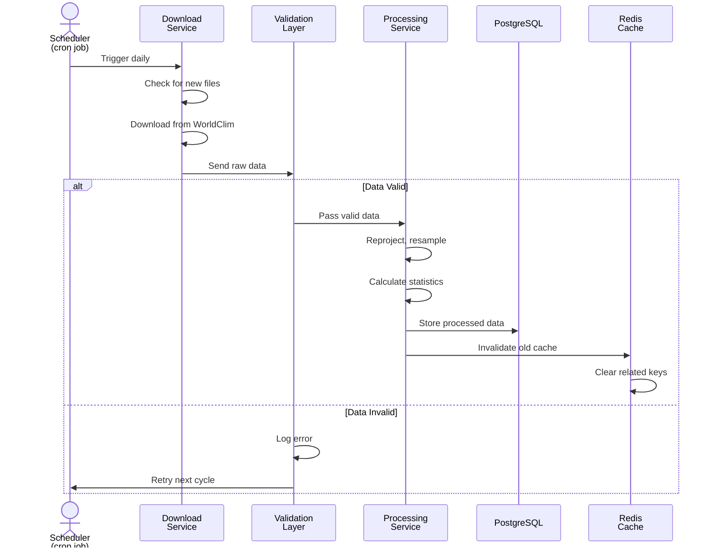
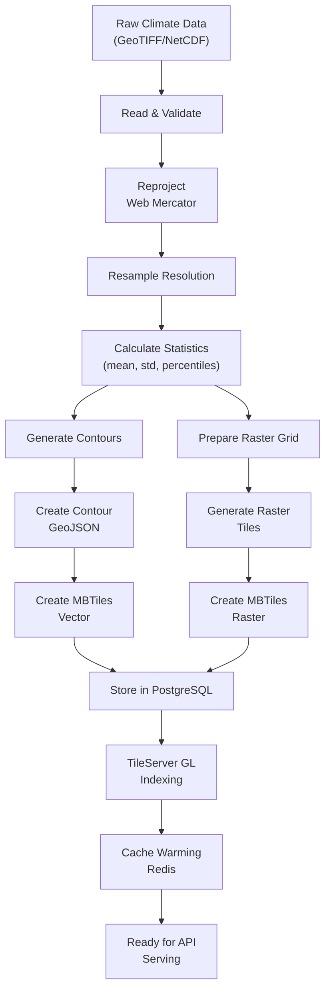
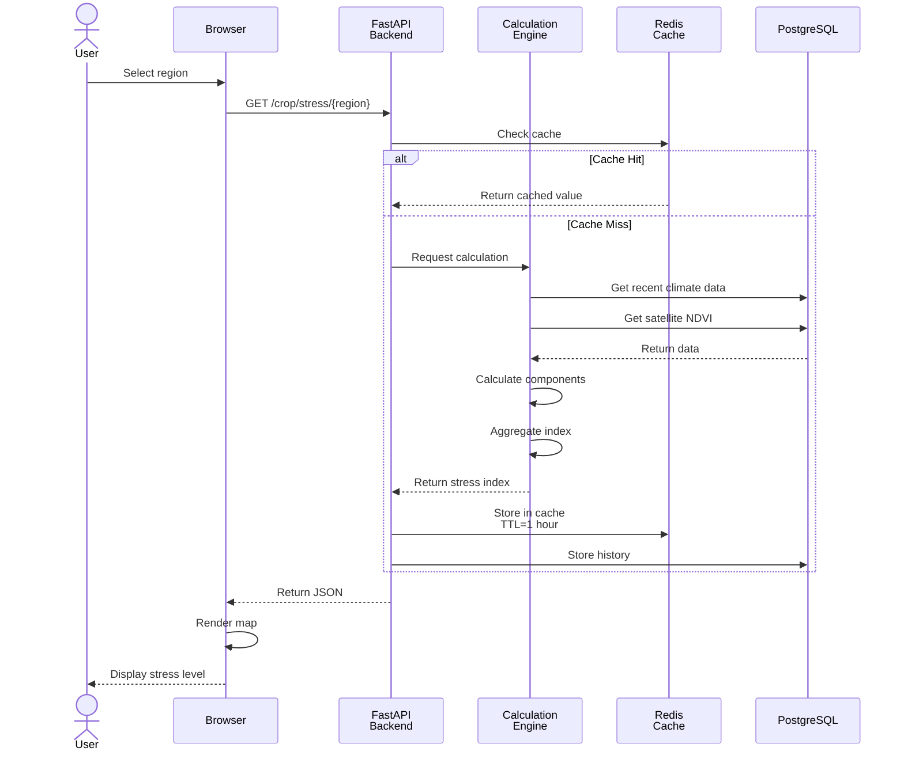
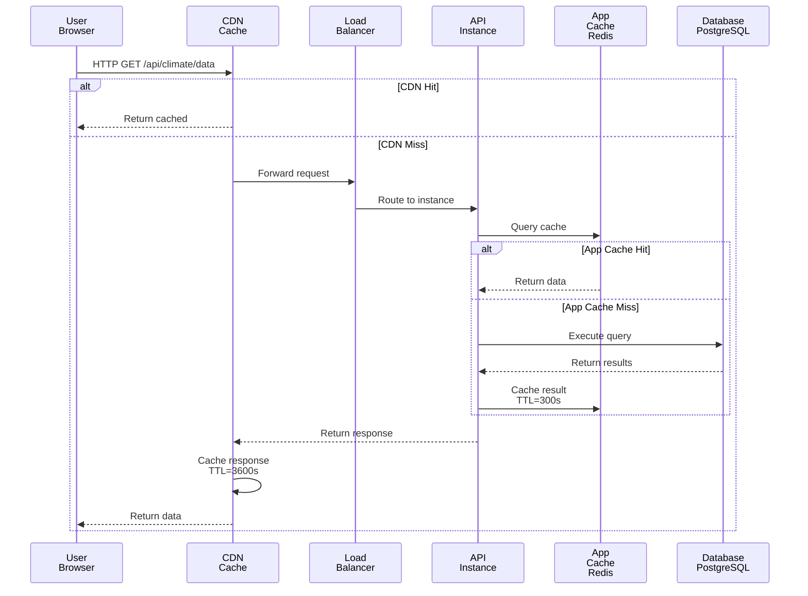
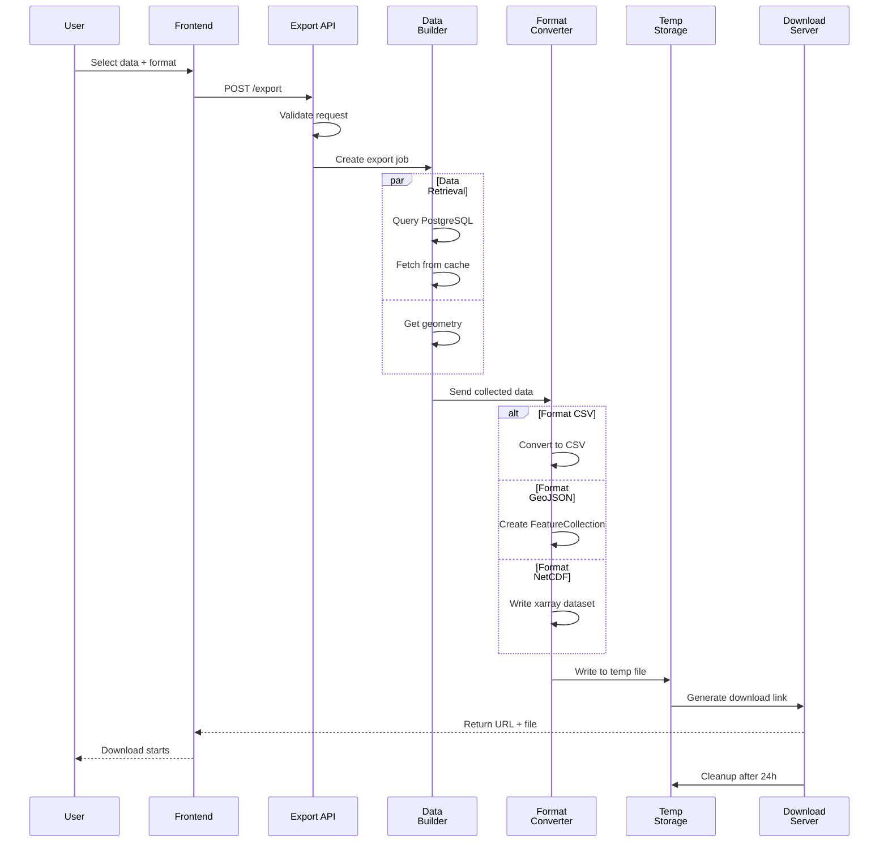
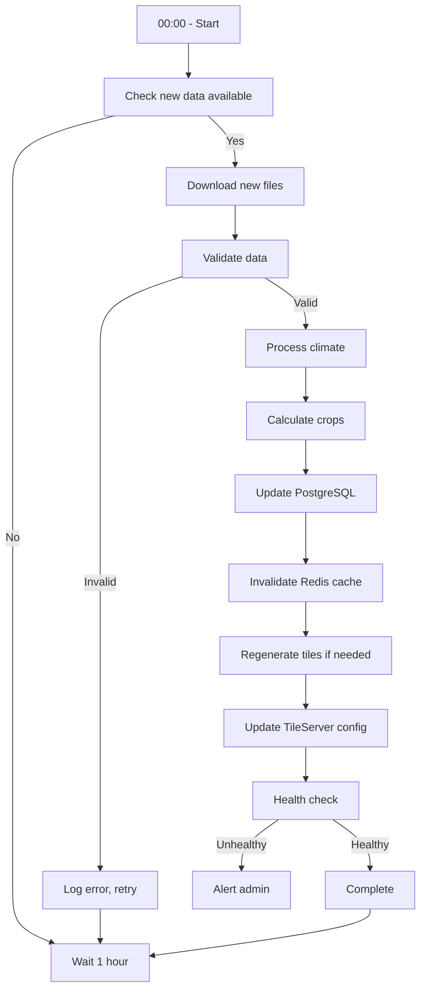
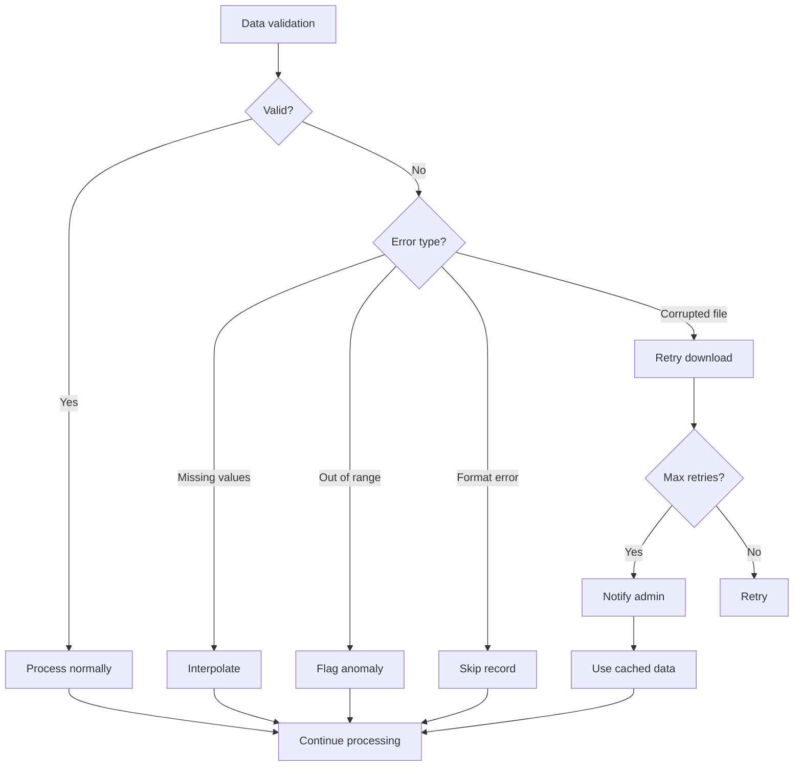
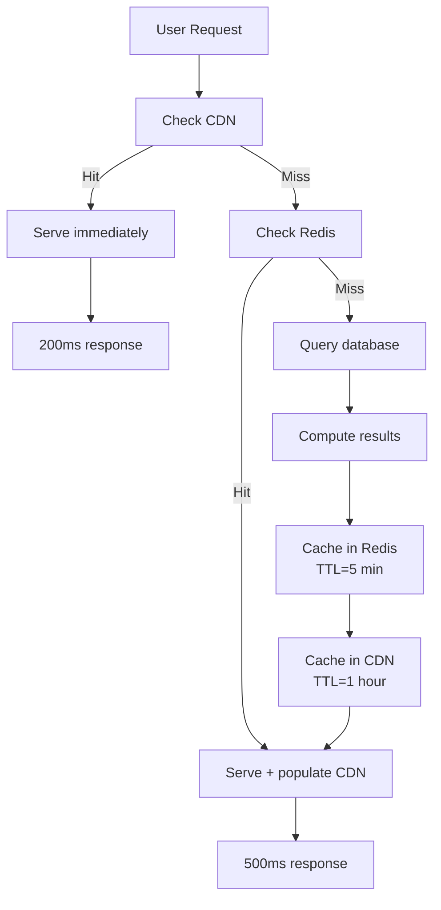

# Data Flow Diagrams

**Data Processing Pipelines and System Workflows**

This document describes how data flows through the HackEarth system, from external sources to user-facing applications.

## Table of Contents

1. [Data Ingestion Flow](#data-ingestion-flow)
2. [Climate Data Pipeline](#climate-data-pipeline)
3. [Crop Stress Pipeline](#crop-stress-pipeline)
4. [Query & Retrieval Flow](#query--retrieval-flow)
5. [Export Flow](#export-flow)
6. [Real-Time Update Flow](#real-time-update-flow)
7. [Error Handling Flows](#error-handling-flows)

---

## Data Ingestion Flow

### Climate Data Ingestion



**Hourly Schedule:**
```
0 2 * * * /usr/bin/python /app/scripts/download_tiles.sh > /var/log/download.log 2>&1
0 3 * * * /usr/bin/python /app/scripts/create_contour.py >> /var/log/contour.log 2>&1
0 4 * * * /usr/bin/python /app/scripts/create_tileserver_config.py >> /var/log/config.log 2>&1
0 5 * * * /usr/bin/python /app/scripts/create_ensemble_mean.py >> /var/log/ensemble.log 2>&1
```

### Data Source Configurations

**WorldClim Download:**
```python
# climatemaps/download.py
WORLDCLIM_URL = "https://data.worldclim.org/download/cmip6/{model}/{ssp}/"
VARIABLES = ['tmin', 'tmax', 'prec', 'srad']
RESOLUTIONS = ['2_5m', '5m', '10m']
SCENARIOS = ['ssp126', 'ssp245', 'ssp370', 'ssp585']
TIME_PERIODS = ['2021-2040', '2041-2060', '2061-2080', '2081-2100']
```

**Sentinel-2 Vegetation Index:**
```python
# Future integration
SENTINEL_HUB_URL = "https://hub.sentinel-hub.com"
PRODUCT = "NDVI"  # Normalized Difference Vegetation Index
UPDATE_FREQUENCY = "5 days"
RESOLUTION = "10m"
```

---

## Climate Data Pipeline

### Complete Climate Processing



### Processing Steps Detail

**Step 1: Read & Validate**
```python
import rasterio
import numpy as np

def read_geotiff(filepath):
    with rasterio.open(filepath) as src:
        # Validate metadata
        assert src.crs == 'EPSG:4326', "Must be WGS84"
        assert src.count == 1, "Must be single band"
        data = src.read(1)
        # Check for NaN/invalid values
        valid_data = np.where(np.isnan(data), -9999, data)
    return valid_data
```

**Step 2: Reproject**
```python
from rasterio.warp import Reproject

# Reproject from EPSG:4326 to Web Mercator (EPSG:3857)
# This matches Leaflet's default projection
reprojected = reproject_raster(data, 'EPSG:4326', 'EPSG:3857')
```

**Step 3: Resample**
```python
# Downsample for web viewing
# Original: 30 arc-seconds (~1km)
# Web:   500m resolution (max detail without overloading browser)
resampled = downsample(reprojected, factor=2)
```

**Step 4: Generate Contours**
```python
import matplotlib.pyplot as plt

levels = np.arange(-40, 50, 5)  # Every 5°C for temperature
contours = plt.contour(temperature_grid, levels=levels)
# Convert to GeoJSON polygons
contour_geojson = contours_to_geojson(contours, levels)
```

**Step 5: Create Tiles**
```bash
# Use tippecanoe to create vector tiles
tippecanoe -zg -o climate_temperature.mbtiles \
    --layer "temperature" \
    --coalesce-densest-as-needed \
    climate_contours.geojson
```

---

## Crop Stress Pipeline

### Real-Time Crop Stress Calculation



### Stress Index Calculation

**Input Data:**
```python
{
    'drought_index': 45.0,      # From rainfall deficit
    'heat_anomaly': 32.0,       # From temperature
    'vegetation_stress': 38.0   # From NDVI
}
```

**Calculation:**
```python
def calculate_stress_index(components):
    """
    Calculate composite crop stress index.
    
    Components weighted:
    - Drought: 40%
    - Heat: 30%
    - Vegetation: 30%
    """
    weights = {
        'drought': 0.40,
        'heat': 0.30,
        'vegetation': 0.30
    }
    
    # Weighted average
    stress = sum(
        components[key] * weights[key]
        for key in weights
    )
    
    # Clip to 0-100 range
    return max(0, min(100, stress))
```

**Output:**
```python
{
    'stress_index': 45.3,
    'components': {
        'drought': {'value': 45.0, 'weight': 0.40},
        'heat': {'value': 32.0, 'weight': 0.30},
        'vegetation': {'value': 38.0, 'weight': 0.30}
    },
    'risk_level': 'HIGH',
    'timestamp': '2024-01-15T14:30:00Z',
    'confidence': 0.85,
    'trend': 'increasing'
}
```

### Component Calculations

**Drought Index:**
```
Data sources: Rainfall data, soil moisture
Formula: D = (Normal_rainfall - Current_rainfall) / Normal_rainfall * 100
Range: 0-100
  0 = No drought
  50 = Moderate drought
  100 = Severe drought
```

**Heat Anomaly:**
```
Data sources: Temperature observations
Formula: H = (Current_temp - Historical_avg) / Historical_std * 30
Range: 0-100
  0 = Cool (below normal)
  50 = Normal
  100 = Extreme heat
```

**Vegetation Stress:**
```
Data sources: Sentinel-2 NDVI
Formula: V = (Normal_NDVI - Current_NDVI) / Normal_NDVI * 100
Range: 0-100
  0 = Healthy (high NDVI)
  50 = Moderate stress
  100 = Dead vegetation (low NDVI)
```

---

## Query & Retrieval Flow

### User Query Resolution



### Typical Queries

**Climate Data Query:**
```sql
SELECT 
    ST_AsGeoJSON(geometry) as geometry,
    value,
    confidence_level,
    date
FROM climate_data
WHERE 
    variable_name = 'temperature'
    AND scenario = 'ssp245'
    AND date = '2050-01-15'
    AND ST_DWithin(
        geometry, 
        ST_GeomFromText('POINT(0 0)', 4326), 
        0.5  -- 0.5 degrees buffer
    )
LIMIT 1000;
```

**Crop Stress Query:**
```sql
SELECT 
    region_name,
    stress_index,
    drought_component,
    heat_component,
    vegetation_component,
    date_time
FROM crop_stress
WHERE 
    region_name = 'Sub-Saharan Africa'
    AND date_time > NOW() - INTERVAL '30 days'
ORDER BY date_time DESC
LIMIT 100;
```

---

## Export Flow

### Data Export Pipeline



### Export Formats

**GeoJSON Example:**
```json
{
  "type": "FeatureCollection",
  "features": [
    {
      "type": "Feature",
      "geometry": {
        "type": "Point",
        "coordinates": [0, 0]
      },
      "properties": {
        "temperature": 25.5,
        "precipitation": 150.2,
        "date": "2024-01-15",
        "confidence": "high"
      }
    }
  ]
}
```

**CSV Example:**
```csv
latitude,longitude,temperature,precipitation,date,confidence
0.0,0.0,25.5,150.2,2024-01-15,high
0.5,0.5,24.8,152.1,2024-01-15,high
1.0,1.0,24.2,155.3,2024-01-15,medium
```

---

## Real-Time Update Flow

### Hourly Update Pipeline



### Update Frequency By Component

| Component | Update Frequency | Source | Latency |
|-----------|-----------------|--------|---------|
| Climate Data (Historical) | Monthly | WorldClim | 3-7 days |
| Climate Projections | Quarterly | CMIP Models | 1-2 weeks |
| Crop Stress Index | Hourly | Weather + Satellite | < 30 min |
| Weather Data | 6-hourly | Open-Meteo | < 1 hour |
| Satellite NDVI | 5-10 days | Sentinel-2 | 1-2 days |

---

## Error Handling Flows

### Data Quality Issues



### API Error Responses

**Example 400 - Bad Request:**
```json
{
  "error": "invalid_request",
  "message": "Missing required parameter: latitude",
  "status": 400,
  "timestamp": "2024-01-15T14:30:00Z"
}
```

**Example 503 - Service Unavailable:**
```json
{
  "error": "service_unavailable",
  "message": "Database connection failed",
  "status": 503,
  "retry_after": 300,
  "timestamp": "2024-01-15T14:30:00Z"
}
```

### Fallback Mechanisms

**Stale Cache Usage:**
- If database unavailable: Serve cached data
- Cache TTL extended: 24 hours → 7 days
- Add warning to UI: "Data may be outdated"

**Degraded Mode:**
- If tiles unavailable: Switch to raster layer
- If zoom unavailable: Use nearest zoom level
- Progressive enhancement: Basic map always available

---

## Performance Optimization

### Caching Strategy



### Tile Pre-Fetching

```python
# Warm cache on startup
def warm_cache():
    """Pre-load common queries."""
    common_regions = ['Africa', 'Asia', 'Americas', 'Europe']
    common_variables = ['temperature', 'precipitation']
    
    for region in common_regions:
        for variable in common_variables:
            key = f"climate:{variable}:{region}"
            if not redis_client.exists(key):
                data = query_database(variable, region)
                redis_client.setex(key, 3600, data)
```

---

## Monitoring & Observability

### Data Flow Metrics

**Ingestion Pipeline:**
- Data downloaded: MB/hour
- Processing duration: minutes
- Success rate: %
- Validation errors: count

**Query Pipeline:**
- Query latency: milliseconds
- Cache hit rate: %
- Database load: CPU %
- Result set size: records

**Export Pipeline:**
- Export requests: count/hour
- Export duration: seconds
- File size: MB
- Format distribution: %

---

## References

**Related Documentation:**
- [Architecture Overview](overview.md)
- [Component Architecture](components.md)
- [Developer Guide](../developer-guide.md)

**External References:**
- [PostGIS Documentation](https://postgis.net/docs/)
- [GDAL Algorithms](https://gdal.org/algorithms/index.html)
- [Tippecanoe Usage](https://github.com/mapbox/tippecanoe)

---

**Last Updated**: February 2, 2026

*For data flow questions, contact [TODO:TECH_OWNER_NAME].*
