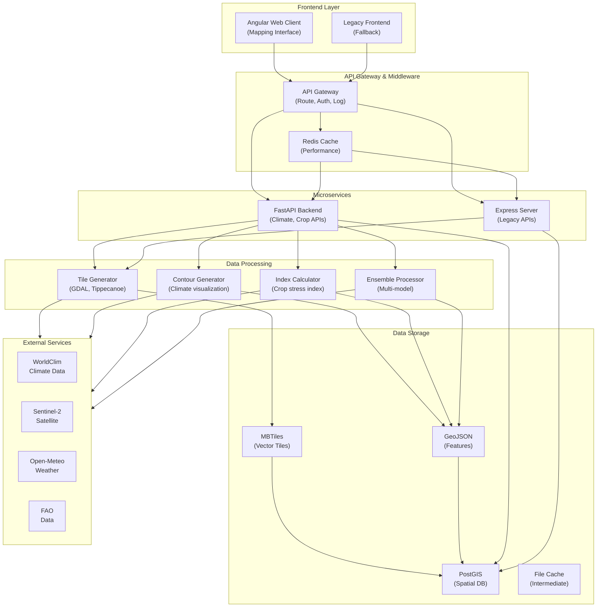

# Architecture Overview

**World Crop Monitor 1.0 System Architecture & Design**

This document provides an executive summary of the World Crop Monitor 1.0 system architecture, key design decisions, and technology choices.

## Table of Contents

1. [Executive Summary](#executive-summary)
2. [System Context](#system-context)
3. [High-Level Architecture](#high-level-architecture)
4. [Technology Stack Rationale](#technology-stack-rationale)
5. [Key Design Decisions](#key-design-decisions)
6. [Non-Functional Requirements](#non-functional-requirements)
7. [Integration Points](#integration-points)

---

## Executive Summary

World Crop Monitor 1.0 is an integrated climate and crop monitoring platform combining historical climate analysis with real-time crop stress assessment. The system processes large geospatial datasets to provide actionable insights for food security stakeholders.

### Key Characteristics

- **Dual Component Architecture**: Climate visualization + Crop stress monitoring
- **Scalable Data Processing**: Handles petabyte-scale climate datasets
- **Real-time Updates**: Sub-hourly refresh for crop stress metrics
- **Open Data First**: Integrates multiple open data sources
- **Geospatial Focus**: Vector tiles for efficient large-scale rendering
- **Accessible Interface**: Web-based UI requiring no special software

### Users & Use Cases

**Primary Users:**
- Food security organizations (WFP, FEWS, FAO)
- NGOs and humanitarian agencies
- Agricultural researchers
- Policy makers and government agencies
- Individual farmers

**Key Use Cases:**
1. Early warning for crop failure
2. Long-term agricultural planning
3. Climate impact assessment
4. Resource allocation for interventions
5. Research and analysis

---

## System Context

### External Systems

```mermaid
graph TB
    Users["👥 Users<br/>(NGOs, Policy, Research)"]
    
    World Crop Monitor 1.0["🏗️ World Crop Monitor 1.0<br/>Core Platform"]
    
    DataSources["📊 Data Sources"]
    Distribution["📡 Distribution"]
    Analysis["📈 Analysis Tools"]
    
    Users --> World Crop Monitor 1.0
    
    DataSources --> WorldClim["WorldClim<br/>Climate Data"]
    DataSources --> Sentinel["Sentinel-2<br/>Satellite Imagery"]
    DataSources --> OpenMeteo["Open-Meteo<br/>Weather API"]
    DataSources --> FAO["FAO<br/>Agriculture Data"]
    DataSources --> ERA5["ERA5<br/>Reanalysis"]
    
    World Crop Monitor 1.0 --> Distribution
    
    Distribution --> Web["Web Interface<br/>https://openclimatemap.org"]
    Distribution --> API["REST API<br/>for third parties"]
    Distribution --> Export["Data Export<br/>GeoJSON, CSV"]
    
    World Crop Monitor 1.0 --> Analysis
    
    Analysis --> QGIS["QGIS<br/>GIS Analysis"]
    Analysis --> Python["Python/R<br/>Scientific Analysis"]
    Analysis --> Reports["Automated<br/>Reports"]
```

### Data Flow Overview

```
Data Sources
    ↓
Data Ingestion (download, validate)
    ↓
Data Processing (harmonize, grid, calculate indices)
    ↓
Tile Generation (vector tiles, rasters)
    ↓
Storage (MBTiles, GeoJSON, PostgreSQL)
    ↓
API Layer (expose via REST endpoints)
    ↓
Frontend (web map, UI controls)
    ↓
Users (visualization, analysis, export)
```

---

## High-Level Architecture

### Component Diagram



### Technology Stack

#### Frontend Layer
- **Angular 16+**: Modern web framework with TypeScript
- **Leaflet.js**: Lightweight mapping library
- **Bootstrap/Material**: Responsive UI components
- **RxJS**: Reactive programming

#### API Layer
- **FastAPI**: High-performance async Python API
- **Express.js**: Node.js web server for legacy APIs
- **Redis**: In-memory caching for performance
- **Pydantic**: Data validation (FastAPI)

#### Data Processing
- **Python/GeoPandas**: Geospatial data manipulation
- **NumPy/SciPy**: Scientific computing
- **xarray**: Multidimensional array processing
- **rasterio**: Raster data I/O
- **gdal2tiles**: Vector tile generation
- **Tippecanoe**: MBTiles creation from GeoJSON

#### Data Storage
- **PostgreSQL + PostGIS**: Spatial database
- **MBTiles**: Vector and raster tiles
- **GeoJSON**: Geospatial features
- **NetCDF**: Climate data format

#### Containerization & Orchestration
- **Docker**: Container runtime
- **Docker Compose**: Multi-container orchestration
- **Kubernetes** (future): Container orchestration for scale

#### Infrastructure
- **Nginx**: Reverse proxy and load balancing
- **TileServer GL**: Tile serving
- **S3/Cloud Storage**: Data archival (optional)

---

## Technology Stack Rationale

### Why Python for Backend?

**Rationale:**
- Excellent scientific computing libraries (NumPy, SciPy)
- Strong geospatial ecosystem (GDAL, GeoPandas, Rasterio)
- Rapid development and prototyping
- Active climate/environmental data science community
- Easy to integrate with processing tools (GDAL, Tippecanoe)

**Trade-offs:**
- Slower than compiled languages (C++, Go)
- Memory overhead for large datasets
- Requires process management in production

**Mitigation:**
- Use async processing (FastAPI)
- Implement caching (Redis)
- Process data offline, serve results
- Use Kubernetes for horizontal scaling

### Why Angular for Frontend?

**Rationale:**
- Enterprise-grade framework
- Strong typing with TypeScript
- Built-in routing and state management
- Excellent for complex interactive maps
- Large community and ecosystem
- Long-term support (Google-backed)

**Trade-offs:**
- Larger bundle size than lighter frameworks
- Steeper learning curve
- More opinionated than alternatives

**Mitigation:**
- Legacy HTML/JS fallback for basic access
- Lazy-load map components
- Progressive enhancement strategy

### Why Docker & Docker Compose?

**Rationale:**
- Reproducible development environment
- Easy local testing and debugging
- Simplified deployment across systems
- Service isolation and independence
- Clear development/production parity

**Trade-offs:**
- Docker overhead vs. native execution
- Complexity for single-service apps (not applicable here)
- Learning curve for DevOps practices

**Mitigation:**
- Use lightweight base images
- Plan Kubernetes migration for scale

### Why Vector Tiles (MBTiles)?

**Rationale:**
- Efficient for geospatial data rendering
- Client-side styling (style layers on demand)
- Reduce bandwidth vs. raster tiles
- Support for multiple zoom levels
- Industry standard (Google Maps, Mapbox)

**Trade-offs:**
- Complex preprocessing required
- Larger initial processing time
- Requires JavaScript-capable browser

---

## Key Design Decisions

### Decision 1: Microservices vs. Monolith

**Decision:** Microservices-oriented architecture

**Rationale:**
- Separation of concerns (Climate API vs. Crop API)
- Independent scaling for different services
- Technology flexibility (Python + Node.js)
- Easier testing and deployment
- Aligns with future Kubernetes migration

**Trade-offs:**
- Increased operational complexity
- Network latency between services
- Data consistency challenges

**Mitigation:**
- Docker Compose for development
- Shared data layer (PostGIS)
- API gateway for unified interface

---

### Decision 2: Real-time vs. Batch Processing

**Decision:** Hybrid approach
- Climate data: Batch processing (data refresh weekly/monthly)
- Crop stress: Real-time calculation (update hourly)

**Rationale:**
- Climate projections don't change frequently
- Crop stress needs current information
- Batch processing allows complex calculations
- Real-time provides early warning capability
- Balances computational load

---

### Decision 3: Open Data vs. Proprietary

**Decision:** Open data sources only

**Rationale:**
- Sustainability and cost (free data)
- Transparency and reproducibility
- International collaboration
- No licensing restrictions
- Alignment with humanitarian mission

**Trade-offs:**
- Limited temporal/spatial resolution options
- Quality varies by source
- Often delayed (not real-time)

---

### Decision 4: Tile-Based Rendering vs. Dynamic Queries

**Decision:** Tile-based rendering with pre-processed data

**Rationale:**
- Orders of magnitude faster rendering
- Low latency for user interactions
- Scales to global coverage
- Reduces database load
- Industry standard approach

**Trade-offs:**
- Significant preprocessing time
- Storage overhead
- Less flexible for ad-hoc queries
- Requires careful zoom level design

---

## Non-Functional Requirements

### Performance

| Metric | Target | Rationale |
|--------|--------|-----------|
| **Page Load** | < 3 seconds | User engagement |
| **Map Pan/Zoom** | < 500ms | Interactive feel |
| **Data Export** | < 30 seconds | User patience |
| **API Response** | < 500ms p95 | Service reliability |
| **Tile Render** | < 5 seconds per tile | Visual responsiveness |

### Scalability

| Dimension | Capacity | Plan |
|-----------|----------|------|
| **Concurrent Users** | 1,000 | Docker Compose, CDN cache |
| **Data Volume** | 100 GB+ | PostgreSQL partitioning, S3 archival |
| **Geographic Coverage** | Global | Tile pre-processing, lazy loading |
| **Variables** | 50+ | Modular data loading |

### Availability

| Metric | Target | Implementation |
|--------|--------|-----------------|
| **Uptime** | 99% | Redundant services, monitoring |
| **Recovery Time** | < 1 hour | Automated backups, failover |
| **Scheduled Maintenance** | < 2 hours/month | Off-peak updates |

### Security

| Aspect | Approach |
|--------|----------|
| **Data Privacy** | No PII collected; open data only |
| **Authentication** | Anonymous access by default |
| **API Security** | Rate limiting, API keys (future) |
| **Data Integrity** | Validation on ingest, checksums |
| **Secrets** | Environment-based, never hardcoded |

### Reliability

| Practice | Implementation |
|----------|-----------------|
| **Error Handling** | Try-catch, fallback UI |
| **Monitoring** | Application metrics, error tracking |
| **Alerting** | Threshold-based alerts for failures |
| **Logging** | Structured logs, centralized logging |

---

## Integration Points

### External Data Sources

**WorldClim Climate Data**
- **Frequency**: Monthly updates (historical)
- **Format**: GeoTIFF, NetCDF
- **Access**: Direct download from archive
- **Integration**: Automated download scripts

**Sentinel-2 Satellite Imagery**
- **Frequency**: Every 5 days
- **Format**: L2A surface reflectance
- **Access**: USGS EROS or Copernicus hub
- **Integration**: Through Sentinelhub API (future)

**Open-Meteo Weather API**
- **Frequency**: Real-time, 6-hourly updates
- **Format**: JSON API
- **Access**: REST API
- **Integration**: Direct API calls from FastAPI

**FAO Data**
- **Frequency**: Quarterly updates
- **Format**: Web services, CSV downloads
- **Access**: Open portal
- **Integration**: Manual ingestion, scheduled jobs

### Output Distribution

**Web Interface**
- Technology: Angular + Leaflet
- Access: Browser-based
- Updates: Real-time cache invalidation

**REST API**
- Base URL: https://api.openclimatemap.org (future)
- Endpoints: /climate/, /crop/, /tiles/
- Authentication: API keys (future)
- Rate limit: [TODO:RATE_LIMIT]

**Data Export**
- Formats: GeoJSON, CSV, NetCDF
- Delivery: Direct download or S3 links
- Size limit: [TODO:SIZE_LIMIT]

---

## Deployment Architecture

### Development

```
Local Docker Compose
├── api (Python/FastAPI)
├── client (Angular dev server)
├── tileserver (TileServer GL)
└── database (PostgreSQL)
```

### Staging

```
Docker Swarm / Kubernetes (1 node)
├── Replicas: 1
├── Volumes: Persistent storage
├── Networking: Service mesh (future)
└── Monitoring: Prometheus + Grafana
```

### Production

```
Kubernetes Cluster (Multi-node)
├── API Pods: 3 replicas (auto-scaling)
├── Worker Pods: Data processing jobs
├── TileServer: CDN-fronted
├── Database: Managed PostgreSQL
├── Networking: Service mesh (Istio future)
└── Monitoring: Full observability stack
```

---

## Future Enhancements

### Short Term (3-6 months)
- [ ] Authentication & user accounts
- [ ] Custom alerts & notifications
- [ ] Advanced analysis tools
- [ ] Multi-language support

### Medium Term (6-12 months)
- [ ] Real-time data ingestion
- [ ] Mobile application
- [ ] Community data contributions
- [ ] Machine learning predictions

### Long Term (12+ months)
- [ ] AI-powered recommendations
- [ ] Integration with early warning systems
- [ ] Automated policy briefings
- [ ] Blockchain for data provenance

---

## References

**Related Documents:**
- [Component Architecture](components.md)
- [Data Flow Diagrams](data-flow.md)
- [Developer Guide](../developer-guide.md)

**External Resources:**
- [GDAL Documentation](https://gdal.org/)
- [FastAPI Documentation](https://fastapi.tiangolo.com/)
- [Angular Style Guide](https://angular.io/guide/styleguide)
- [PostGIS Manual](https://postgis.net/docs/)

---

**Last Updated**: February 2, 2026

*Architecture reviews: Contact [TODO:TECH_OWNER_NAME]. For proposed changes, see [Architecture Decision Records](decisions.md).*
