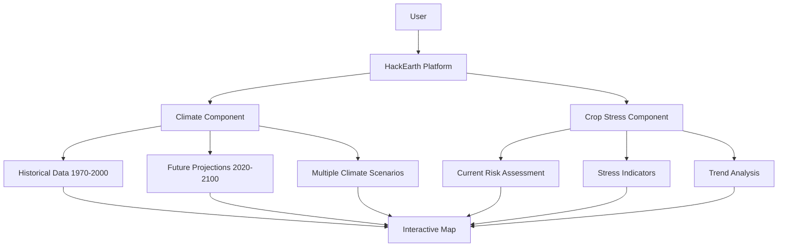
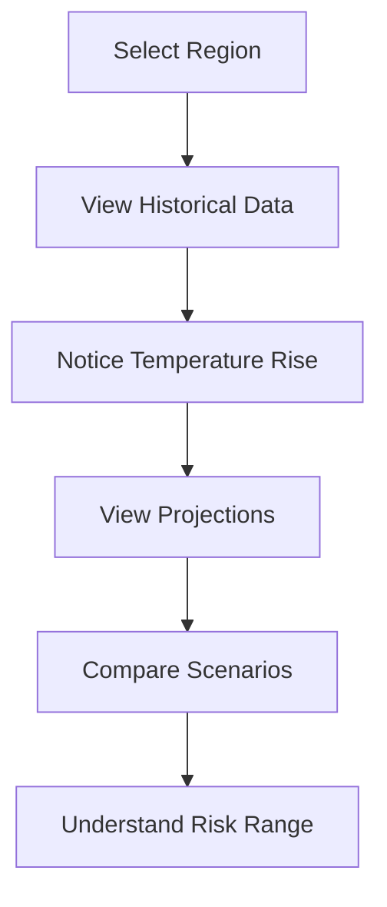

# User Guide

**HackEarth - End-User Documentation**

Welcome to HackEarth! This guide will help you understand how to use the platform to monitor climate trends and crop stress conditions globally.

## Table of Contents

1. [Getting Started](#getting-started)
2. [Overview](#overview)
3. [Climate Visualization](#climate-visualization)
4. [Crop Stress Monitoring](#crop-stress-monitoring)
5. [Common Tasks](#common-tasks)
6. [Interpreting Results](#interpreting-results)
7. [Data Export](#data-export)
8. [Troubleshooting](#troubleshooting)
9. [Getting Help](#getting-help)

---

## Getting Started

### Accessing HackEarth

**Option 1: Online (Recommended)**
- Visit: https://openclimatemap.org
- No installation or account required
- Works in any modern web browser

**Option 2: Local Installation**
- Contact [TODO:TECH_OWNER_NAME] for local deployment
- Requires Docker and 8GB RAM minimum
- Instructions: See [Developer Guide](../developer-guide.md)

### System Requirements

**Browser Compatibility:**
- Chrome/Chromium 90+
- Firefox 88+
- Safari 14+
- Edge 90+

**Recommended:**
- Modern laptop or desktop computer
- High-speed internet (for data loading)
- Large monitor (1920x1080 or larger)

### First Login

1. Navigate to https://openclimatemap.org
2. The homepage displays an interactive world map
3. No username/password required for basic access
4. Hover over regions to see available data layers

---

## Overview

HackEarth is an integrated platform with two main components:

### 1. Climate Visualization
Analyze historical climate data and future projections to understand climate trends and impacts on agriculture.

### 2. Crop Stress Monitoring
Monitor real-time crop stress indicators across key agricultural regions to identify at-risk areas early.



---

## Climate Visualization

### Accessing Climate Data

#### 1. Select Component
```
Home → Climate Maps
```

#### 2. Choose Climate Variable

Available variables:
- **Temperature**: Annual, seasonal variations
- **Precipitation**: Rainfall patterns and anomalies
- **Humidity**: Soil moisture and relative humidity
- **Wind**: Wind speed and direction patterns
- **Solar Radiation**: Incident radiation on surface

#### 3. Select Time Period

**Historical Data:**
- Years: 1970-2000
- Resolution: Annual, monthly
- Source: CRU TS, WorldClim, ERA5

**Future Projections:**
- Years: 2020-2100
- Resolution: Decadal (10-year average)
- Source: CMIP5, CMIP6 models

#### 4. Choose Scenario (For Projections Only)

Climate scenarios represent different greenhouse gas emission futures:

| Scenario | Description | Expected Change by 2100 |
|----------|-------------|-------------------------|
| **SSP1-2.6** | Sustainable development, low emissions | +1.5°C (best case) |
| **SSP2-4.5** | Middle-of-road pathway | +2.7°C (moderate) |
| **SSP3-7.0** | Fragmented world, high emissions | +3.6°C (pessimistic) |
| **SSP5-8.5** | Rapid growth, very high emissions | +4.4°C (worst case) |

**Recommendation:** Compare multiple scenarios to understand uncertainty range.

### Using the Climate Map

#### Navigation
- **Zoom**: Scroll wheel or pinch gesture
- **Pan**: Click and drag
- **Reset**: "Home" button in top-left corner
- **Search**: Use location search bar to jump to specific region

#### Reading the Map

**Color Scale:**
- **Blue**: Cooler/Wetter than normal
- **Green**: Near average conditions
- **Yellow**: Warmer/Drier than normal
- **Red**: Much warmer/Much drier than normal
- **Purple**: Extreme values

**Legend:**
- Shows current variable's units and scale
- Adjusts based on selected variable
- Hover over legend items to highlight specific ranges

#### Time Series Analysis

1. **Select a location** by clicking on map
2. **View time series graph** showing:
   - Historical trends (1970-2000)
   - Projected changes (2020-2100)
   - Confidence intervals
   - Seasonal variations

Example: Temperature trends in Sub-Saharan Africa


### Interpreting Climate Data

#### Temperature Anomalies
- **+1 to +2°C**: Noticeable warming, impacts on crop phenology
- **+2 to +3°C**: Significant stress on traditional crops
- **+3°C+**: Major agricultural disruption likely

#### Precipitation Changes
- **-20% to -30%**: Increased drought stress
- **-30% to -50%**: Significant water shortage
- **+20% to +30%**: Flooding risk increases
- **+30%+**: Severe flooding and erosion risk

#### Seasonal Patterns
Critical for agriculture:
- **Growing season shift**: Earlier or later onset
- **Heat waves**: Duration and intensity
- **Dry spells**: Length and frequency
- **Rainfall distribution**: Concentration vs. spread

### Exporting Climate Data

1. Click **"Export Data"** button
2. Select format:
   - **GeoJSON**: Geographic data format
   - **CSV**: Spreadsheet format
   - **NetCDF**: Scientific data format
3. Choose spatial extent:
   - **Current view**: Just visible area
   - **Country/Region**: Administrative boundary
   - **Global**: All data (large file)
4. Choose time range
5. Click **"Download"**

---

## Crop Stress Monitoring

### Accessing Crop Stress Data

#### 1. Navigate to Crop Stress Section
```
Home → Crop Stress Monitor
```

#### 2. View Current Risk Assessment

The map displays regions colored by stress level:

| Color | Level | Action Required |
|-------|-------|-----------------|
| 🟩 Green | Low (0-24) | Routine monitoring |
| 🟨 Yellow | Medium (25-49) | Monitor closely, prepare contingencies |
| 🟧 Orange | High (50-74) | Active response needed |
| 🔴 Red | Critical (75-100) | Immediate intervention |

### Understanding Crop Stress Index

The Crop Stress Index combines three factors:

**1. Drought Index (40% weight)**
```
Measures:
- Rainfall deficiency
- Soil moisture levels
- Days since last rain
```

**2. Heat Anomaly (30% weight)**
```
Measures:
- Temperature above crop-specific thresholds
- Duration and intensity of heat stress
- Cumulative heat exposure
```

**3. Vegetation Stress (30% weight)**
```
Measures:
- NDVI (Normalized Difference Vegetation Index)
- Vegetation greenness anomalies
- Biomass changes from satellite
```

### Monitoring Regional Conditions

#### 1. Select Region
Click on region of interest on map or use dropdown:
- Sub-Saharan Africa
- South Asia
- Southeast Asia
- Central America
- East Africa
- Middle East
- Australasia
- Others

#### 2. View Key Indicators

For selected region, see:
- **Current Stress Index**: Today's value
- **Trend**: Increasing/decreasing over last week
- **Components**: Breakdown of three factors
- **Historical**: Last 30, 90, 365 days

#### 3. Review Historical Trends

#### 4. Check Forecasts

14-day outlook based on:
- Weather forecasts
- Seasonal projections
- Historical patterns

### Interpreting Crop Stress Results

#### Low Stress (0-24)
- **Conditions**: Normal seasonal patterns
- **Crops**: Generally suitable for growth
- **Action**: Continue routine farming practices

#### Medium Stress (25-49)
- **Conditions**: Emerging stress indicators
- **Crops**: Some impacts on specific, sensitive crops
- **Action**:
  - Increase irrigation if available
  - Monitor precipitation forecasts
  - Prepare contingency plans
  - Consider crop variety adjustments

#### High Stress (50-74)
- **Conditions**: Significant stress indicators
- **Crops**: Most traditional crops experiencing stress
- **Action**:
  - Implement water conservation measures
  - Apply supplementary irrigation
  - Consider alternative crop timing
  - Prepare for crop losses
  - Activate early warning response

#### Critical Stress (75-100)
- **Conditions**: Severe stress, crop failure likely
- **Crops**: Crop failure imminent or ongoing
- **Action**:
  - Implement emergency responses
  - Activate humanitarian assistance
  - Prepare for food security interventions
  - Engage international support
  - Document impacts for recovery planning

### Spatial Analysis

#### Viewing Risk Distribution
- **Regional view**: See all areas at once
- **Zoom in**: Examine specific districts
- **Compare**: Side-by-side comparison of regions

#### Identifying Hotspots

**High Risk Regions (Last 30 days):**
1. Click "Hotspots" tab
2. Regions sorted by average stress level
3. Shows trend (improving/worsening)
4. Quick links to detailed analysis

#### Cross-Regional Comparison

```
Region Comparison Tool:
- Select 2-3 regions
- View stress index trend
- Compare climate drivers
- Export for reports
```

---

## Common Tasks

### Task 1: Assess Drought Risk in a Specific Country

**Steps:**
1. Go to Climate Visualization
2. Select "Precipitation" variable
3. Select recent year data
4. Look for areas with 20%+ below-normal rainfall
5. Switch to Crop Stress Monitor
6. Observe Drought Index for same region
7. Export data for reporting

**Time required:** 5-10 minutes

### Task 2: Compare Climate Scenarios for Long-Term Planning

**Steps:**
1. Select Climate Visualization
2. Choose future projections (2050)
3. Select Temperature variable
4. View SSP1-2.6 scenario (best case)
5. Note the temperature change
6. Switch to SSP5-8.5 scenario (worst case)
7. Compare and record both
8. Export both scenarios for comparison

**Time required:** 10-15 minutes

### Task 3: Monitor Crop Stress Trends Over Time

**Steps:**
1. Go to Crop Stress Monitor
2. Select target region
3. View current Stress Index
4. Click "Historical Trends"
5. Select "Last 90 days"
6. Note overall trend and recent spikes
7. Switch to Climate tab
8. Check if stress correlates with rainfall/temperature
9. View forecast for next 14 days
10. Export full report

**Time required:** 15-20 minutes

### Task 4: Generate a Report for Decision-Makers

**Steps:**
1. Open Crop Stress Monitor
2. Select relevant regions for report
3. Take screenshots of key maps
4. Export current data (CSV format)
5. Export historical trends (GeoJSON)
6. Export climate data relevant to decision
7. Compile into presentation or document
8. Add interpretive text and recommendations

**Time required:** 30-45 minutes

### Task 5: Set Up Regular Monitoring Alerts

**Currently Available:**
- Email notifications (if configured)
- RSS feeds for regional data
- Weekly summary reports

**To Enable:**
1. Go to Settings
2. Select "Notifications"
3. Choose regions and thresholds
4. Set frequency (daily/weekly)
5. Enter email address
6. Confirm subscription

---

## Interpreting Results

### Understanding Confidence and Uncertainty

#### Data Confidence Levels

| Level | Meaning | Use Case |
|-------|---------|----------|
| **High** | >90% certainty | Policy decisions, resource allocation |
| **Medium** | 70-90% certainty | Planning, contingency preparation |
| **Low** | <70% certainty | Trend indication, not primary decision driver |

**How to see confidence:**
- Hover over map areas
- Check tooltip for confidence indicator
- More opaque = higher confidence
- More transparent = lower confidence

#### Uncertainty in Climate Projections

Climate projections have inherent uncertainty because:
1. **Model uncertainty**: Different models give different results
2. **Scenario uncertainty**: Future emissions paths are unknown
3. **Internal variability**: Natural climate fluctuations

**Best practice:** Always examine multiple scenarios (SSP1-2.6 through SSP5-8.5) to understand the range of possible futures.

### Comparing Multiple Data Sources

HackEarth integrates data from multiple sources:

**Climate Data Sources:**
- WorldClim (primary)
- CRU TS (secondary)
- ERA5 (validation)

**Crop Data Sources:**
- Sentinel-2 NDVI
- Weather station data
- FAO statistics
- Regional reports

**When sources diverge:**
1. Examine individual confidence levels
2. Check data quality for each source
3. Review publication dates
4. Contact support if significant discrepancy

---

## Data Export

### Export Formats

**GeoJSON:**
- Standard geospatial format
- Compatible with GIS software (ArcGIS, QGIS)
- Easy to import into web maps
- **File size:** Medium

**CSV (Comma-Separated Values):**
- Excel/spreadsheet compatible
- Easy to analyze in pivot tables
- Standard text format
- **File size:** Small

**NetCDF:**
- Scientific data format
- Preserves all metadata
- Compatible with R, Python
- **File size:** Large

### How to Export Data

**From Climate Visualization:**
1. Make your selections (variable, time, region)
2. Click "Export" button
3. Choose format
4. Select spatial extent
5. Click "Download"
6. File appears in Downloads folder

**From Crop Stress Monitor:**
1. Select region(s)
2. Select time period
3. Click "Export Report"
4. Choose format
5. Review options
6. Click "Generate"
7. Download when ready

### Using Exported Data

**In Excel/Google Sheets:**
```
1. Download CSV format
2. Open in Excel
3. Create pivot tables for analysis
4. Generate charts
5. Export for presentations
```

**In QGIS (GIS Analysis):**
```
1. Download GeoJSON format
2. Open QGIS
3. File → Open Data Source Manager
4. Load GeoJSON file
5. Create maps and analysis
6. Export as shapefile or other format
```

**In R/Python (Statistical Analysis):**
```python
import geopandas as gpd
import pandas as pd

# Load GeoJSON
gdf = gpd.read_file('export.geojson')

# Load CSV
df = pd.read_csv('export.csv')

# Analyze and visualize
```

---

## Troubleshooting

### Common Issues

#### Issue 1: Map Not Loading

**Symptoms:**
- Blank white map area
- "Loading..." message doesn't disappear
- Map tiles not displaying

**Solutions:**
1. **Check internet connection**
   - Reload page (Ctrl+R or Cmd+R)
   - Wait 30 seconds for data to load

2. **Clear browser cache**
   - Chrome: Settings → Clear Browsing Data
   - Firefox: History → Clear Recent History
   - Safari: Develop → Empty Web Storage

3. **Try different browser**
   - Some browsers have compatibility issues
   - Latest Chrome/Firefox usually works best

4. **Check system resources**
   - Close other applications
   - Ensure 2GB+ free RAM
   - Restart computer if needed

#### Issue 2: Slow Performance

**Symptoms:**
- Map takes >10 seconds to pan
- Data export very slow
- Page freezes when clicking

**Solutions:**
1. **Reduce map complexity**
   - Zoom to specific area instead of global
   - Select fewer data layers

2. **Check internet speed**
   - Use fast connection (broadband)
   - Avoid peak hours

3. **Try local deployment**
   - Contact admin for local version
   - Typically faster than cloud

#### Issue 3: Data Looks Unusual

**Symptoms:**
- Extreme values in specific area
- Sudden jumps in time series
- Different from expected patterns

**Verification steps:**
1. **Check data source**
   - Hover to see which dataset
   - Note publication date

2. **Verify time period**
   - Confirm correct year/month selected
   - Check historical vs. projected toggle

3. **Compare with other sources**
   - World Weather Online
   - National meteorological services
   - NOAA/NASA satellites

4. **Report if still suspicious**
   - Email: [TODO:SUPPORT_EMAIL]
   - Include: time, location, what looks wrong

#### Issue 4: Export Not Working

**Symptoms:**
- Export button doesn't respond
- Download appears but file won't open
- File is 0 bytes

**Solutions:**
1. **Try different browser**
   - Some browsers have download issues
   - Firefox usually most reliable

2. **Check file format support**
   - Your application might not support format
   - Try different format (CSV vs. GeoJSON)

3. **Reduce export size**
   - Export specific region instead of global
   - Export shorter time period
   - Export one variable at a time

4. **Contact support**
   - Try again in 30 minutes
   - Email logs to [TODO:SUPPORT_EMAIL]

---

## Getting Help

### Support Channels

| Channel | Best For | Response Time |
|---------|----------|----------------|
| **Slack** | Quick questions, troubleshooting | < 1 hour |
| **Email** | Detailed issues, bug reports | 24 hours |
| **Phone** | Urgent issues | During business hours |
| **Documentation** | General questions, how-to's | Immediate (self-service) |

### Reaching Out

**Slack:** [TODO:SLACK_CHANNEL]
- Direct message @[TODO:TECH_OWNER_NAME]
- Post in #general and tag support team

**Email:** [TODO:SUPPORT_EMAIL]
- Include: what you were trying to do, what happened, what you expected
- Attach: screenshot or error message if applicable

**Phone:** [TODO:PHONE_NUMBER]
- Available: Mon-Fri, [TODO:BUSINESS_HOURS]
- For urgent issues only

### Providing Feedback

**Feature Requests:**
- What feature would help you?
- How would you use it?
- Send to: [TODO:PRODUCT_OWNER_NAME]

**Bug Reports:**
- Describe what you were doing
- What was the unexpected behavior?
- Send to: [TODO:SUPPORT_EMAIL]

**Data Quality Issues:**
- Which region/data shows issue?
- When did you first notice it?
- What does it look like?
- Send to: [TODO:TECH_OWNER_NAME]

---

## Additional Resources

### Learn More

**Climate Science Basics:**
- [IPCC Climate Change 2021 Report](https://www.ipcc.ch/assessment-report/ar6/)
- [NASA Climate 101](https://climate.nasa.gov/)
- [NOAA Climate Tutorial](https://www.weather.gov/jetstream/)

**Agricultural Impacts:**
- [FAO Climate Change & Food Security](https://www.fao.org/climate-change/en)
- [CGIAR Climate Research](https://ccafs.cgiar.org/)

**Using GIS and Data:**
- [QGIS Getting Started](https://docs.qgis.org/)
- [ArcGIS Resources](https://www.esri.com/en-us/arcgis/learn)

### Video Tutorials

**Getting Started (5 min):**
[TODO:VIDEO_LINK_START]

**Climate Analysis (10 min):**
[TODO:VIDEO_LINK_CLIMATE]

**Crop Monitoring (10 min):**
[TODO:VIDEO_LINK_CROP]

**Data Export (5 min):**
[TODO:VIDEO_LINK_EXPORT]

---

**Last Updated**: February 2, 2026

*Need help? Contact [TODO:SUPPORT_EMAIL] or post in [TODO:SLACK_CHANNEL]*
